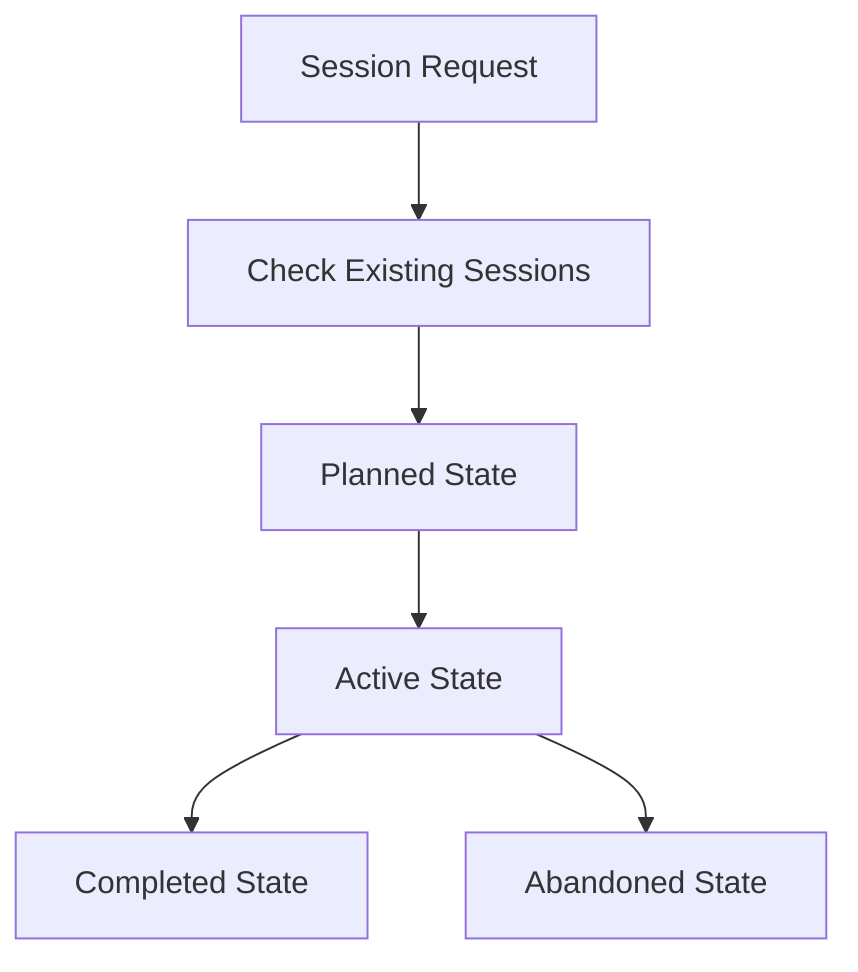

# LLM Coding Agent Patterns

A comprehensive framework for organizing and managing LLM-powered coding agent sessions, featuring structured workflows, persona-driven development, and trunk-based development practices.

## Overview

This project provides a systematic approach to managing coding agent sessions, ensuring consistent documentation, progress tracking, and knowledge capture. It's designed to help developers and AI agents work together more effectively by providing clear patterns and workflows.

## Key Features

### 🎯 Structured Session Management
- **State-based workflow**: Sessions move through planned → active → completed/abandoned states
- **Comprehensive documentation**: Each session includes context, acceptance criteria, and implementation plans
- **Progress tracking**: Detailed worklogs and dynamic implementation plans

### 👥 Persona-Driven Development
- **Dana**: Data Architect focused on data strategy and impact
- **Oscar**: Software Architect with Python expertise, advocate for elegant solutions
- **Argo**: Corporate perspective that identifies risks and assumptions

### 🔄 Trunk-Based Development Integration
- **Session branches**: Each session gets its own branch (`session/YYYY-MM-DD-descriptive-slug`)
- **Frequent merges**: Sub-sessions are merged to main regularly
- **Clean history**: Squash merges maintain logical units of work

### 📋 Sub-session Orchestration
- **Epic breakdown**: Large sessions are broken into manageable sub-sessions
- **TDD integration**: Red-Green-Refactor cycles with proper documentation
- **Acceptance criteria**: Clear success metrics for each sub-session

## Project Structure

```
_AGENTS/
├── personas/
│   └── personas.md          # Development personas for different perspectives
└── sessions/
    ├── active/              # Currently active sessions
    ├── completed/           # Finished sessions
    ├── planned/             # Future sessions
    ├── abandoned/           # Cancelled/incomplete sessions
    └── SESSIONS-README.md   # Detailed session management documentation
```

## Session Lifecycle



## Getting Started

1. **Create a new session**: Follow the naming convention `YYYY-MM-DD-descriptive-slug`
2. **Document context**: Define what the session is about and success criteria
3. **Break into sub-sessions**: Identify manageable chunks of work
4. **Track progress**: Use worklogs and dynamic implementation plans
5. **Apply personas**: Leverage Dana, Oscar, and Argo for different perspectives

## Session Documentation

Each session includes:
- **SESSION.md**: Core documentation with context and acceptance criteria
- **worklog.md**: Progress tracking with timestamps and decisions
- **active-plan.md**: Dynamic implementation plan with task lists
- **subsessions.md**: Sub-session organization and status
- **patch file**: Final patch generated after completion

## Best Practices

- **Update frequently**: Keep documentation current with work progress
- **Document decisions**: Provide context for future agents and developers
- **Be honest**: Record failures and lessons learned
- **Clean up**: Remove temporary files when sessions complete
- **Use specific commits**: Avoid `git add .` - be explicit about what you're committing

## Contributing

This framework is designed to evolve with your needs. Feel free to:
- Add new personas for different perspectives
- Extend session documentation templates
- Improve workflow patterns
- Share successful session examples

## License

This project is open source and available under the [MIT License](LICENSE).
