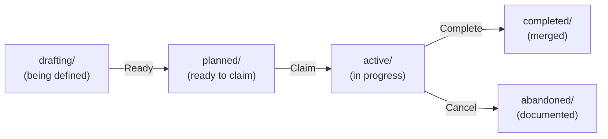

# Agent Sessions Protocol

> **📖 For detailed examples, git commands, and troubleshooting:** See [SESSIONS-REFERENCE.md](SESSIONS-REFERENCE.md)

## Purpose

Sessions are **structured units of work** that enable multiple AI agents to collaborate on a codebase concurrently without conflicts. Each session:

- Has clear **context** (what needs to be done)
- Has **acceptance criteria** (definition of done)
- Tracks **progress** (worklog, decisions, lessons learned)
- Produces **artifacts** (code changes, documentation, knowledge)
- Maintains **traceability** (git attribution, patch files)

Sessions move through states (`drafting` → `planned` → `active` → `completed`) as work progresses, creating a clear audit trail of what was done, by whom, and why.

### Basic Flow

Sessions move through states as work progresses:



1. **Draft** - Session created in `drafting/` (context, criteria, plan incomplete)
2. **Ready** - Moved to `planned/` when ready for agents to claim
3. **Claim** - Agent atomically claims session from `planned/` via git push
4. **Activate** - Source `.session-env` to establish agent identity
5. **Work** - Make changes, update worklog, capture learnings
6. **Complete** - Generate patch, create KB merge session if needed, merge to main

### Multi-Agent Coordination

**Background agents can monitor `planned/`** for sessions matching their capabilities.

Multiple sessions work concurrently:
- Session `2025-10-14-auth-system` → works → completes
- Session `2025-10-14-api-refactor` → works → completes (in parallel)
- Sessions never block each other

Coordination through **git** (no orchestrator):
- Session claims via atomic git push
- Namespace isolation via branch names and commits
- Optimistic locking handles race conditions gracefully

## Quick Start

### Using Utility Scripts (Recommended)

```bash
# Claim and activate session
./_bin/claim-session 2025-10-14-feature-x
# Note: SESSION.md becomes read-only to preserve original plan

# Activate session environment (in session clone)
cd .sessions/2025-10-14-feature-x
source .session-env

# Work on session (use worklog.md, active-plan.md for updates)...

# Complete session (unlocks SESSION.md for final updates)
cd ../..
./_bin/complete-session 2025-10-14-feature-x
```

### Manual Process (Advanced)

#### Starting a Session

```bash
# 1. Claim session
git pull origin main
echo "2025-10-14-feature-x:$(date +%s)" >> .agents/sessions.lock
git add .agents/sessions.lock
git commit -m "[2025-10-14-feature-x] Claim session"
git push origin main  # If fails, pick different session

# 2. Move to active and create activation file
mv sessions/planned/2025-10-14-feature-x sessions/active/
git add sessions/ && git commit -m "[2025-10-14-feature-x] Move to active"

# 3. Set SESSION.md to read-only
chmod 444 sessions/active/2025-10-14-feature-x/SESSION.md
git add sessions/active/2025-10-14-feature-x/SESSION.md
git commit -m "[2025-10-14-feature-x] Set SESSION.md read-only"
cat > sessions/active/2025-10-14-feature-x/.session-env << 'EOF'
export GIT_AUTHOR_NAME="Cursor-Local-1 (via cristos)"
export GIT_AUTHOR_EMAIL="cristos+2025-10-14-feature-x@agents.local"
export GIT_COMMITTER_NAME="Session-2025-10-14-feature-x (via cristos)"
export GIT_COMMITTER_EMAIL="cristos+2025-10-14-feature-x@agents.local"
export SESSION_ID="2025-10-14-feature-x"
export SESSION_SLUG="2025-10-14-feature-x"
EOF

git add sessions/active/2025-10-14-feature-x/.session-env
git commit -m "[2025-10-14-feature-x] Add session environment"

# 4. Create session clone with session branch (outside sessions/)
git clone --depth 1 --single-branch --branch main \
  . .sessions/2025-10-14-feature-x
cd .sessions/2025-10-14-feature-x
git checkout -b session/2025-10-14-feature-x
git remote rename origin upstream

# 5. Activate session and start work
source ../../sessions/active/2025-10-14-feature-x/.session-env

# Now working in isolated session clone!
```

#### Completing a Session

```bash
# 1. Finalize documentation (worklog, active-plan, generate patch)
cd .sessions/2025-10-14-feature-x
git format-patch main --stdout > ../../sessions/active/2025-10-14-feature-x/2025-10-14-feature-x.patch

# 2. Check for KB learnings and create KB merge session if exists
if [ -f "_AGENTS/knowledge/sessions/2025-10-14-feature-x/learnings.md" ]; then
  # Create KB merge session in drafting/
  # [Use KB merge session template]
fi

# 3. Return to main repo and remove session clone
cd ../..  # Back to repo root
rm -rf .sessions/2025-10-14-feature-x

# 4. Merge to main
git pull origin main
git merge --squash session/2025-10-14-feature-x
git commit -m "[2025-10-14-feature-x] Session complete: Implement user authentication system

- Added JWT-based authentication with refresh tokens
- Created User model with bcrypt password hashing
- Implemented login/logout endpoints with proper validation
- Added middleware for protected routes
- Created comprehensive test suite (95% coverage)
- Updated API documentation with auth examples
- Resolved security vulnerabilities in password handling

Session artifacts:
- 12 files changed, 847 insertions(+), 23 deletions(-)
- Patch: sessions/completed/2025-10-14-feature-x/2025-10-14-feature-x.patch
- Worklog: sessions/completed/2025-10-14-feature-x/worklog.md
- KB learnings: _AGENTS/knowledge/sessions/2025-10-14-feature-x/learnings.md"
git push origin main

# 5. Unlock SESSION.md for final updates
chmod 644 sessions/active/2025-10-14-feature-x/SESSION.md
git add sessions/active/2025-10-14-feature-x/SESSION.md
git commit -m "[2025-10-14-feature-x] Unlock SESSION.md for final updates"

# 6. Remove session from lock and move to completed
sed -i '/^2025-10-14-feature-x:/d' .agents/sessions.lock
git add .agents/sessions.lock
mv sessions/active/2025-10-14-feature-x sessions/completed/
git add sessions/ && git commit -m "[2025-10-14-feature-x] Archive session"
git push origin main

# 7. Set SESSION.md back to read-only in completed
chmod 444 sessions/completed/2025-10-14-feature-x/SESSION.md
git add sessions/completed/2025-10-14-feature-x/SESSION.md
git commit -m "[2025-10-14-feature-x] Set SESSION.md read-only in completed"

# 8. Cleanup branch and deactivate
git branch -d session/2025-10-14-feature-x
unset GIT_AUTHOR_NAME GIT_AUTHOR_EMAIL GIT_COMMITTER_NAME GIT_COMMITTER_EMAIL
unset SESSION_SLUG SESSION_ID

# Session context ended
```

See [SESSIONS-REFERENCE.md](SESSIONS-REFERENCE.md#quick-reference) for complete examples.

## Implementation SOP

### Core Principles

1. **Git as Coordinator** - Use git itself for synchronization (no external orchestrator)
2. **Session-Scoped Activation** - Agent identity via environment variables, session lifecycle
3. **Namespace Isolation** - Each session works in separate worktrees/branches
4. **Optimistic Locking** - Session claims via atomic git operations
5. **Full Traceability** - Every commit attributed to specific agent
6. **Two-Phase Knowledge** - Capture learnings fast, merge deliberately via KB sessions

### Directory Structure

```
.agents/
└── sessions.lock    # Active session claims (session-id:timestamp)

.worktrees/          # Git worktrees (isolated workspaces)
├── 2025-10-14-auth-system/     # Full repo copy for this session
├── 2025-10-14-api-work/        # Full repo copy for this session
└── ...

sessions/
├── _bin/            # Utility scripts
│   ├── claim-session
│   └── complete-session
├── _templates/      # Templates for sessions and configs
│   ├── SESSION.md.j2           # Standard session template
│   ├── kb-merge-SESSION.md     # KB merge session template
│   └── session-env.template    # Session environment template
├── SESSIONS-README.md        # This file (essential protocol)
├── SESSIONS-REFERENCE.md     # Detailed examples & commands
├── abandoned/       # Cancelled/incomplete sessions
├── active/          # Currently active sessions (metadata only)
│   ├── 2025-10-14-auth-system/
│   │   ├── .session-env
│   │   ├── SESSION.md
│   │   ├── worklog.md
│   │   └── active-plan.md
│   ├── 2025-10-14-api-work/
│   └── ...
├── completed/       # Finished sessions (all agents)
├── drafting/        # Sessions being defined (not ready for agents)
└── planned/         # Ready to claim (agents monitor this)
```

**Utilities** (`_bin/`, `_templates/`) sort first, keeping them separate from **state directories** (`abandoned/`, `active/`, `completed/`, `drafting/`, `planned/`).

### Session States

| State | Location | Description |
|-------|----------|-------------|
| **Drafting** | `drafting/` | Being defined, not ready for agents yet |
| **Planned** | `planned/` | Ready to claim, agents can monitor this |
| **Active** | `active/` | Being worked on by an agent |
| **Completed** | `completed/` | Successfully finished and merged |
| **Abandoned** | `abandoned/` | Cancelled or incomplete, documented |

### SESSION.md Read-Only Protection

**Purpose: Drift Tracking**
- SESSION.md files become **read-only** when sessions move to `active/`
- This preserves the original plan for drift analysis
- Compare original plan vs. actual work to identify scope changes
- Learn from planning inaccuracies for future sessions

**When SESSION.md is Read-Only:**
- In `active/` sessions: **Read-only** (chmod 444)
- In `completed/` sessions: **Read-only** (chmod 444)
- In `planned/` and `drafting/`: **Writable** (chmod 644)

**Update Channels During Active Work:**
- `worklog.md` - Progress, decisions, timestamps
- `active-plan.md` - Current tasks, issues, next steps
- `subsessions.md` - Scope additions (creates new sessions)

**Unlock Process (Completion Only):**
1. `complete-session` script unlocks SESSION.md for final updates
2. Agent can add final notes if needed
3. SESSION.md becomes read-only again in `completed/`

**Override (Emergency Only):**
```bash
# Emergency fix only
chmod 644 sessions/active/{session-slug}/SESSION.md
# Make critical fix
git add sessions/active/{session-slug}/SESSION.md
git commit -m "[{session-slug}] OVERRIDE: Fix critical SESSION.md error"
chmod 444 sessions/active/{session-slug}/SESSION.md
# Document reason in worklog.md
```

**Why This Matters:**
- Enables drift analysis between planned vs. actual work
- Catches scope creep early
- Improves future session planning accuracy
- Maintains audit trail of original intent

**FAQ: Why is SESSION.md read-only?**
- **Answer:** To preserve the original plan for drift analysis. By keeping SESSION.md unchanged, we can compare what was planned vs. what actually happened, identify scope creep, and learn from planning inaccuracies.

**FAQ: How do I track scope changes?**
- **Answer:** Use `worklog.md` for progress updates, `active-plan.md` for task changes, and `subsessions.md` for scope additions that create new sessions. These files are writable during active work.

### Session Activation & Claiming

Agent identity is established per-session via environment variables. The `claim-session` script creates a `.session-env` file in the session directory.

**Claim Process:**

1. Pull latest: `git pull origin main`
2. Check `.agents/sessions.lock` for availability
3. Add claim: `echo "{session-slug}:$(date +%s)" >> .agents/sessions.lock`
4. Commit and push: `git commit -m "[2025-10-14-feature-x] Claim session" && git push`
5. If push fails (race condition), pick different session
6. Move session to `active/{session-slug}/` and commit
7. Create `.session-env` file in session directory and commit
8. Create worktree with session branch: `git worktree add -b session/{slug} .worktrees/{slug}`
9. Activate session in worktree: `source ../../sessions/active/{slug}/.session-env`

**Activation:**

```bash
cd .worktrees/{session-slug}
source ../../sessions/active/{session-slug}/.session-env
```

Session activation sets git identity and environment for that session only. The `.session-env` file contains all environment variables for this session's agent identity.

See [SESSIONS-REFERENCE.md](SESSIONS-REFERENCE.md#session-claim-and-activation) for complete implementation.

### Naming Conventions

#### Session Folders

Format: `YYYY-MM-DD-descriptive-slug`

**Standard sessions:**
- `2025-10-14-auth-system`
- `2025-10-14-api-refactor`

**KB merge sessions:**
- `kb-2025-10-14-merge-auth-patterns`
- `kb-2025-10-14-merge-api-security`

#### Git Branches

Format: `session/{session-id}`

**Examples:**
- `session/2025-10-14-auth-system`
- `session/kb-2025-10-14-merge-auth-patterns`

#### Commit Messages

Format: `[{session-id}] <type>: <description>`

**Examples:**
- `[2025-10-14-auth-system] feat: add user authentication`
- `[2025-10-14-api-refactor] fix: resolve memory leak`
- `[2025-10-14-docs-update] docs: update API documentation`

### Session Contents

#### Standard Session Files

- **`SESSION.md`** - Context, acceptance criteria, subsessions (with TDD structure)
- **`worklog.md`** - Progress tracking with timestamps
- **`active-plan.md`** - Dynamic task lists, issues, next steps
- **`subsessions.md`** - Sub-session tracking
- **`{session-slug}.patch`** - Final patch file (generated at completion)

#### Session Templates

The `_templates/` directory provides Jinja2 templates for creating consistent session files:

**`SESSION.md.j2`** - Standard session template with comprehensive structure:
- **Variables**: `SESSION_SLUG`, `CONTEXT`, `PROBLEM_STATEMENT`, `ACCEPTANCE_CRITERIA`, `SUBSESSIONS`, `RISKS`, `DEPENDENCIES`, `EDGE_CASES`, `NOTES`
- **Usage**: Automatically used by session creation tools, or manually with template substitution
- **Structure**: Includes context, problem analysis, comprehensive acceptance criteria (combining requirements and success metrics), subsessions (with implicit TDD RED->GREEN->REFACTOR cycle), risk mitigation, dependencies, and edge case considerations

**`kb-merge-SESSION.md.j2`** - KB merge session template:
- **Variables**: `TOPIC`, `SOURCE_SESSION`, `TIMESTAMP`
- **Usage**: Automatically created by complete-session script when learnings exist
- **Purpose**: Guides systematic merging of session learnings into canonical knowledge base

**`session-env.template.j2`** - Session environment template:
- **Variables**: `SESSION_SLUG`, `USER_NAME`, `USER_EMAIL`
- **Usage**: Automatically created by claim-session script for session activation
- **Purpose**: Establishes agent identity and session-specific environment variables

#### KB Merge Session Files

Simplified structure for KB merge sessions:
- **`SESSION.md`** - Auto-generated with source session reference
- **`worklog.md`** - KB merge decisions and conflicts

> **📊 For detailed state flowcharts:** See [SESSIONS-REFERENCE.md](SESSIONS-REFERENCE.md#detailed-state-flowcharts)

## Knowledge Base SOP

### Two-Phase Strategy

**Phase 1: Session-Scoped Capture (During Work)**
- Write to: `_AGENTS/knowledge/sessions/{session-slug}/learnings.md`
- Isolated per session, zero conflicts
- Fast, autonomous documentation

**Phase 2: Canonical Merge (Dedicated Session)**
- KB merge session auto-created at completion
- Any agent can execute merge
- Deliberate review and quality control
- Merge to: `_AGENTS/knowledge/`

### KB Access Rules

| Action | Path | When | Who |
|--------|------|------|-----|
| **Read KB** | `knowledge/` | Anytime | All agents |
| **Write Learnings** | `knowledge/sessions/{session}/` | During work | Owning agent |
| **Merge to Canonical** | `knowledge/` | KB merge session only | Assigned agent |

**Critical:** Only `kb-` prefixed sessions may write to the canonical knowledge base. All other sessions must write exclusively to `knowledge/sessions/{session-id}/`.

## Git Workflow SOP

### Branch Strategy

- Each session gets session-namespaced branch
- Frequent merges to main (per sub-session or daily)
- Squash merge for clean history
- Session branch deleted after completion

### Commit Strategy

All commits prefixed with session ID and automatically attributed via session environment:

```bash
# Code changes (uses GIT_AUTHOR_NAME/EMAIL from .session-env)
git add src/ && git commit -m "[2025-10-14-feature-x] feat: implement feature"

# Session files
git add sessions/ && git commit -m "[2025-10-14-feature-x] docs: update worklog"

# KB learnings
git add _AGENTS/knowledge/sessions/ && git commit -m "[2025-10-14-feature-x] docs: capture learnings"

# KB canonical (only in KB merge sessions)
git add _AGENTS/knowledge/ && git commit -m "[2025-10-14-feature-x] docs: merge KB learnings"
```

**Note:** Git automatically uses `GIT_AUTHOR_NAME`, `GIT_COMMITTER_NAME`, etc. from environment when set.

**Avoid:** `git add .` - be specific about what you're committing.

## Conflict Resolution

### Conflict Types

| Type | Strategy | How It Works |
|------|----------|--------------|
| **Session Files** | Namespace isolation | Each session in `active/{session-slug}/` |
| **KB Learnings** | Session-scoped | Each session in `sessions/{session-slug}/` |
| **Canonical KB** | KB merge sessions | Only via dedicated sessions |
| **Code Files** | Git merge | Standard resolution, document in worklog |
| **Session Claims** | Optimistic locking | Retry with different session |

See [SESSIONS-REFERENCE.md](SESSIONS-REFERENCE.md#conflict-resolution-examples) for detailed examples.

## Best Practices

### General
1. Update documentation frequently
2. Document decisions for future agents
3. Be honest about failures and learnings
4. Clean up temporary files

### Multi-Agent Specific
5. **Always pull before claiming** - Get latest state first
6. **Handle race conditions gracefully** - Pick different session if claim fails
7. **Namespace everything** - Use `.worktrees/{session-slug}/` and `session/{session-id}`
8. **Session-prefixed commits** - Every commit tagged with `[{session-id}]`
9. **KB learnings are session-scoped** - Never write directly to `knowledge/`
10. **Create KB merge sessions** - Auto-generate at session completion
11. **Verify session activation** - Check environment variables are set (`echo $GIT_AUTHOR_NAME`)
12. **Coordinate via git** - No file system locks or external tools

---

**📚 For more details:** See [SESSIONS-REFERENCE.md](SESSIONS-REFERENCE.md) for complete examples, git commands, and troubleshooting.
