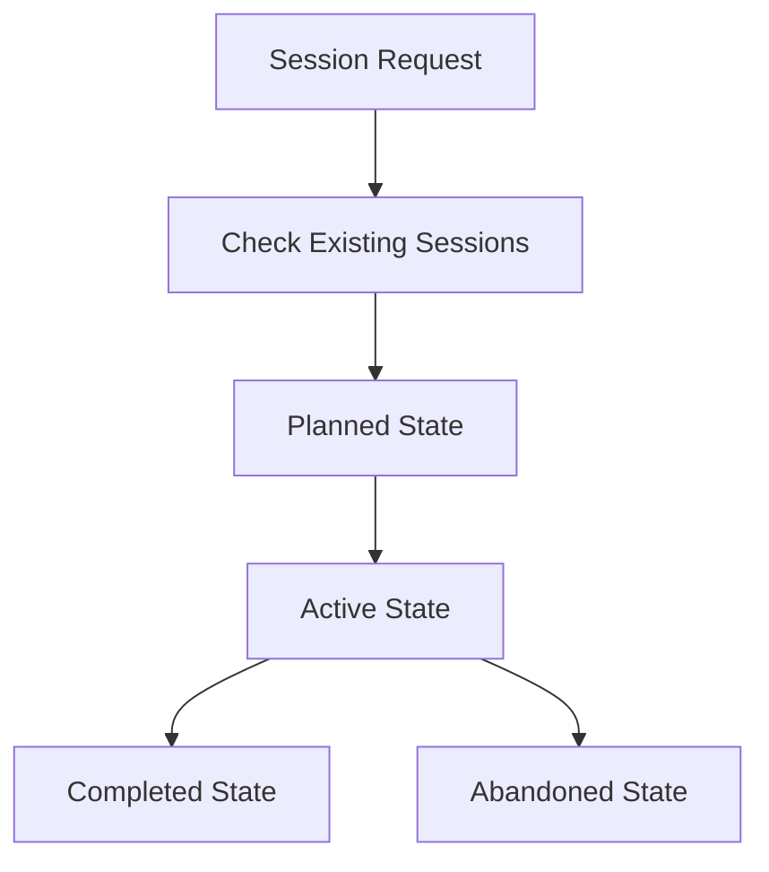

# Agent Sessions Directory

This directory contains organized session folders for tracking agent work across different states and purposes.

> **📖 For detailed examples, git commands, and troubleshooting:** See [SESSIONS-REFERENCE.md](SESSIONS-REFERENCE.md)

## Directory Structure

```
sessions/
├── active/          # Currently active sessions
│   ├── {agent-id}/  # Agent-specific active sessions
│   └── ...
├── completed/       # Finished sessions (all agents)
├── planned/         # Future sessions (any agent can claim)
├── abandoned/       # Cancelled/incomplete sessions
├── SESSIONS-README.md        # This file (essential protocol)
└── SESSIONS-REFERENCE.md     # Detailed examples & commands
```

## Multi-Agent Coordination

This protocol supports multiple agents working concurrently across local and cloud environments **without an orchestrator**. Agents coordinate through git using optimistic locking and namespace isolation.

### Core Principles

1. **Git as Coordinator** - Use git itself for synchronization (no external orchestrator)
2. **Namespace Isolation** - Each agent works in separate directories/branches
3. **Optimistic Locking** - Session claims via atomic git operations
4. **Agent Attribution** - Every commit tagged with agent identity
5. **Two-Phase Knowledge** - Capture learnings fast, merge deliberately

### Agent Identity Setup

Each agent must configure a unique git identity:

```bash
# Format: "{Agent-Type}-{Agent-ID} (via {Human})"
git config user.name "Cursor-Local-1 (via cristos)"
git config user.email "cristos+cursor-1@agents.local"
```

**Why?** Full commit traceability, easy rollback, clear accountability in git history.

**Setup:** Git worktrees recommended (one per agent). See [SESSIONS-REFERENCE.md](SESSIONS-REFERENCE.md#git-worktrees-setup) for details.

### Session Claiming

Agents claim sessions atomically via git:

1. Pull latest: `git pull origin main`
2. Check `.agents/sessions.lock` for availability
3. Add claim: `echo "{agent-id}:{session-slug}:$(date +%s)" >> .agents/sessions.lock`
4. Commit and push: `git commit -m "[{agent-id}] Claim session" && git push`
5. If push fails (race condition), pick different session

See [SESSIONS-REFERENCE.md](SESSIONS-REFERENCE.md#session-claim-protocol) for complete code example.

## Naming Conventions

### Session Folders

Format: `YYYY-MM-DD-descriptive-slug`

**Standard sessions:**
- `2025-10-14-auth-system`
- `2025-10-14-api-refactor`

**KB merge sessions:**
- `kb-2025-10-14-merge-auth-patterns`
- `kb-2025-10-14-merge-api-security`

### Git Branches

Format: `session/{agent-id}/YYYY-MM-DD-descriptive-slug`

**Examples:**
- `session/cursor-1/2025-10-14-auth-system`
- `session/claude-a/kb-2025-10-14-merge-auth-patterns`

### Commit Messages

Format: `[{agent-id}] <type>: <description>`

**Examples:**
- `[cursor-1] feat: add user authentication`
- `[claude-a] fix: resolve memory leak`
- `[cursor-1] docs: update API documentation`

## Session Contents

### Standard Session Files

- **`SESSION.md`** - Context, acceptance criteria, implementation plan
- **`worklog.md`** - Progress tracking with timestamps
- **`active-plan.md`** - Dynamic task lists, issues, next steps
- **`subsessions.md`** - Sub-session tracking
- **`{session-slug}.patch`** - Final patch file (generated at completion)

### KB Merge Session Files

Simplified structure for KB merge sessions:
- **`SESSION.md`** - Auto-generated with source session reference
- **`worklog.md`** - KB merge decisions and conflicts

## Session Lifecycle



### State Transitions

**Planned → Active:**
1. Claim session via `.agents/sessions.lock`
2. Move to `sessions/active/{agent-id}/`
3. Create session branch: `session/{agent-id}/{session-slug}`
4. Begin work

**Active → Completed:**
1. Finalize documentation (worklog, active-plan)
2. Generate patch file
3. **Check for KB learnings** → create KB merge session if exists
4. Move to `sessions/completed/`
5. Squash merge to main
6. Delete session branch

See [SESSIONS-REFERENCE.md](SESSIONS-REFERENCE.md#detailed-state-flowcharts) for detailed flowcharts.

## Knowledge Base Management

### Two-Phase Strategy

**Phase 1: Session-Scoped Capture (During Work)**
- Write to: `_AGENTS/knowledge/sessions/{session-slug}/learnings.md`
- Isolated per session, zero conflicts
- Fast, autonomous documentation

**Phase 2: Canonical Merge (Dedicated Session)**
- KB merge session auto-created at completion
- Any agent can execute merge
- Deliberate review and quality control
- Merge to: `_AGENTS/knowledge/shared/`

### KB Access Rules

| Action | Path | When | Who |
|--------|------|------|-----|
| **Read KB** | `knowledge/shared/` | Anytime | All agents |
| **Write Learnings** | `knowledge/sessions/{session}/` | During work | Owning agent |
| **Merge to Canonical** | `knowledge/shared/` | KB merge session only | Assigned agent |

**Critical:** Never write directly to `knowledge/shared/` during regular sessions. Always use KB merge sessions.

## Trunk-Based Development

### Branch Strategy

- Each session gets agent-namespaced branch
- Frequent merges to main (per sub-session or daily)
- Squash merge for clean history
- Session branch deleted after completion

### Commit Strategy

All commits prefixed with agent ID:

```bash
# Code changes
git add src/ && git commit -m "[cursor-1] feat: implement feature"

# Session files
git add sessions/ && git commit -m "[cursor-1] docs: update worklog"

# KB learnings
git add _AGENTS/knowledge/sessions/ && git commit -m "[cursor-1] docs: capture learnings"

# KB canonical (only in KB merge sessions)
git add _AGENTS/knowledge/shared/ && git commit -m "[cursor-1] docs: merge KB learnings"
```

**Avoid:** `git add .` - be specific about what you're committing.

## Conflict Resolution

### Conflict Types

| Type | Strategy | How It Works |
|------|----------|--------------|
| **Session Files** | Namespace isolation | Each agent in `active/{agent-id}/` |
| **KB Learnings** | Session-scoped | Each session in `sessions/{session-slug}/` |
| **Canonical KB** | KB merge sessions | Only via dedicated sessions |
| **Code Files** | Git merge | Standard resolution, document in worklog |
| **Session Claims** | Optimistic locking | Retry with different session |

See [SESSIONS-REFERENCE.md](SESSIONS-REFERENCE.md#conflict-resolution-examples) for detailed examples.

## Best Practices

### General
1. Update documentation frequently
2. Document decisions for future agents
3. Be honest about failures and learnings
4. Clean up temporary files

### Multi-Agent Specific
5. **Always pull before claiming** - Get latest state first
6. **Handle race conditions gracefully** - Pick different session if claim fails
7. **Namespace everything** - Use `active/{agent-id}/` and `session/{agent-id}/`
8. **Agent-prefixed commits** - Every commit tagged with `[{agent-id}]`
9. **KB learnings are session-scoped** - Never write directly to `knowledge/shared/`
10. **Create KB merge sessions** - Auto-generate at session completion
11. **Verify agent identity** - Check git config before starting
12. **Coordinate via git** - No file system locks or external tools

## Session States

| State | Location | Description |
|-------|----------|-------------|
| **Planned** | `planned/` | Future work, any agent can claim |
| **Active** | `active/{agent-id}/` | Being worked on by specific agent |
| **Completed** | `completed/` | Successfully finished |
| **Abandoned** | `abandoned/` | Cancelled or incomplete |

## Quick Start

### Starting a Session

```bash
# 1. Setup identity (once per worktree)
git config user.name "Cursor-Local-1 (via cristos)"
git config user.email "cristos+cursor-1@agents.local"

# 2. Claim session
git pull origin main
echo "cursor-1:2025-10-14-feature-x:$(date +%s)" >> .agents/sessions.lock
git add .agents/sessions.lock
git commit -m "[cursor-1] Claim session 2025-10-14-feature-x"
git push origin main  # If fails, pick different session

# 3. Move to active and create branch
mv sessions/planned/2025-10-14-feature-x sessions/active/cursor-1/
git checkout -b session/cursor-1/2025-10-14-feature-x

# 4. Start work!
```

### Completing a Session

```bash
# 1. Finalize documentation (worklog, active-plan, generate patch)

# 2. Check for KB learnings and create KB merge session if exists
if [ -f "_AGENTS/knowledge/sessions/2025-10-14-feature-x/learnings.md" ]; then
  # Create KB merge session in planned/
  # [Use KB merge session template]
fi

# 3. Move to completed
mv sessions/active/cursor-1/2025-10-14-feature-x sessions/completed/
git add sessions/ && git commit -m "[cursor-1] Complete session"

# 4. Merge to main
git checkout main
git pull origin main
git merge --squash session/cursor-1/2025-10-14-feature-x
git commit -m "[cursor-1] Session complete: 2025-10-14-feature-x"
git push origin main

# 5. Cleanup
git branch -d session/cursor-1/2025-10-14-feature-x
```

See [SESSIONS-REFERENCE.md](SESSIONS-REFERENCE.md#quick-reference) for complete examples.

## Summary

This multi-agent protocol enables autonomous, distributed collaboration through:

1. **Git-Based Coordination** - No orchestrator, git provides atomic operations
2. **Namespace Isolation** - Separate paths/branches minimize conflicts
3. **Two-Phase Knowledge** - Fast capture, deliberate merge
4. **Full Traceability** - Every commit attributed to specific agent
5. **Optimistic Locking** - Session claims via git push races
6. **Worktree Isolation** - Each agent has own working directory
7. **Quality Control** - KB merges are reviewable sessions

**Key Principle:** Use git itself as the distributed coordination system.

---

**📚 Next Steps:**
- See [SESSIONS-REFERENCE.md](SESSIONS-REFERENCE.md) for detailed examples, git commands, and troubleshooting
- Review existing sessions in `planned/` to claim work
- Set up your agent identity and worktree
