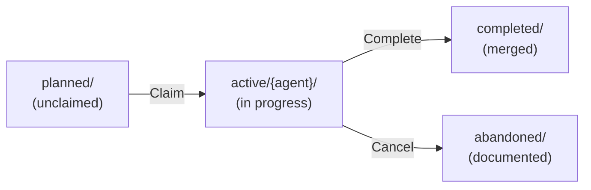
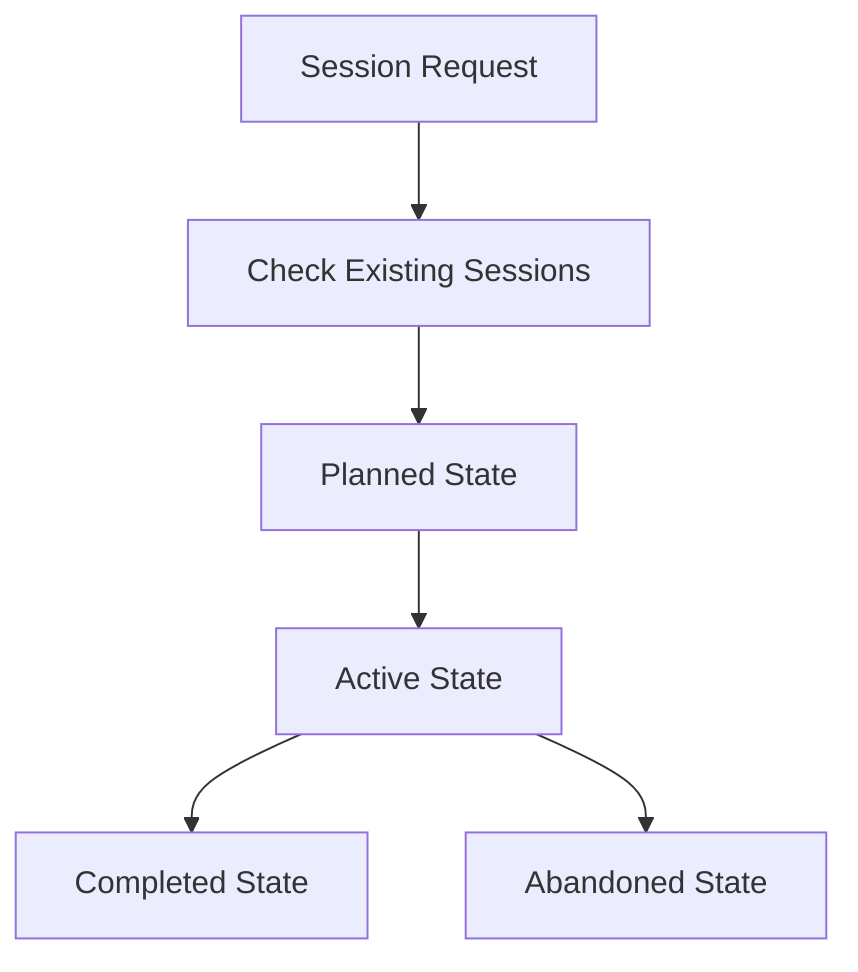

# Agent Sessions Protocol

> **📖 For detailed examples, git commands, and troubleshooting:** See [SESSIONS-REFERENCE.md](SESSIONS-REFERENCE.md)

## Purpose

Sessions are **structured units of work** that enable multiple AI agents to collaborate on a codebase concurrently without conflicts. Each session:

- Has clear **context** (what needs to be done)
- Has **acceptance criteria** (definition of done)
- Tracks **progress** (worklog, decisions, lessons learned)
- Produces **artifacts** (code changes, documentation, knowledge)
- Maintains **traceability** (git attribution, patch files)

Sessions move through states (`planned` → `active` → `completed`) as work progresses, creating a clear audit trail of what was done, by whom, and why.

## Workflow Overview



### Basic Workflow

1. **Claim a session** - Agent atomically claims work from `planned/`
2. **Activate session** - Environment variables establish agent identity
3. **Work** - Make changes, update worklog, capture learnings
4. **Complete** - Generate patch, create KB merge session if needed, merge to main
5. **Deactivate** - Unset environment, session context ends

### Multi-Agent Workflow

Multiple agents work concurrently:
- Agent `cursor-1` claims session A → works → completes
- Agent `claude-a` claims session B → works → completes (in parallel)
- Agent `cursor-1` claims session C → works → completes

Agents coordinate through **git itself** (no orchestrator needed):
- Session claims via atomic git push
- Namespace isolation (`active/cursor-1/`, `active/claude-a/`)
- Optimistic locking (race conditions handled gracefully)

## Core Principles

1. **Git as Coordinator** - Use git itself for synchronization (no external orchestrator)
2. **Session-Scoped Activation** - Agent identity via environment variables, session lifecycle
3. **Namespace Isolation** - Each agent works in separate directories/branches
4. **Optimistic Locking** - Session claims via atomic git operations
5. **Full Traceability** - Every commit attributed to specific agent
6. **Two-Phase Knowledge** - Capture learnings fast, merge deliberately via KB sessions

## Directory Structure

```
sessions/
├── _bin/            # Utility scripts
│   ├── claim-session
│   └── complete-session
├── _templates/      # Templates for sessions and configs
│   ├── kb-merge-SESSION.md
│   └── session-env.template
├── SESSIONS-README.md        # This file (essential protocol)
├── SESSIONS-REFERENCE.md     # Detailed examples & commands
├── abandoned/       # Cancelled/incomplete sessions
├── active/          # Currently active sessions
│   ├── {agent-id}/  # Agent-specific active sessions
│   └── ...
├── completed/       # Finished sessions (all agents)
└── planned/         # Future sessions (any agent can claim)
```

**Utilities** (`_bin/`, `_templates/`) sort first, keeping them separate from **state directories** (`abandoned/`, `active/`, `completed/`, `planned/`).

## Session Activation

When claiming a session, the agent context is established through environment variables (not git config):

```bash
# Set per-session (in .session-env file)
export GIT_AUTHOR_NAME="Cursor-Local-1 (via cristos)"
export GIT_AUTHOR_EMAIL="cristos+cursor-1@agents.local"
export GIT_COMMITTER_NAME="Cursor-Local-1 (via cristos)"
export GIT_COMMITTER_EMAIL="cristos+cursor-1@agents.local"
export SESSION_AGENT="cursor-1"
export SESSION_SLUG="2025-10-14-auth-system"
```

**Why environment variables?**
- No git config pollution (safe for supervised agents sharing workspace)
- Session-scoped (activation ends when session completes)
- Explicit identity per session
- Works in any context (worktree or main repo)

**Session activation = Agent identity for that session.**

## Session Claiming & Activation

Claiming a session establishes the agent context for that work:

1. Pull latest: `git pull origin main`
2. Check `.agents/sessions.lock` for availability
3. Add claim: `echo "{agent-id}:{session-slug}:$(date +%s)" >> .agents/sessions.lock`
4. Commit and push: `git commit -m "[{agent-id}] Claim session" && git push`
5. If push fails (race condition), pick different session
6. Move session to `active/{agent-id}/`
7. Create `.session-env` file in session directory
8. Create session branch and activate: `source .session-env`

**The `.session-env` file contains all environment variables for this session's agent identity.**

See [SESSIONS-REFERENCE.md](SESSIONS-REFERENCE.md#session-claim-and-activation) for complete implementation.

## Naming Conventions

### Session Folders

Format: `YYYY-MM-DD-descriptive-slug`

**Standard sessions:**
- `2025-10-14-auth-system`
- `2025-10-14-api-refactor`

**KB merge sessions:**
- `kb-2025-10-14-merge-auth-patterns`
- `kb-2025-10-14-merge-api-security`

### Git Branches

Format: `session/{agent-id}/YYYY-MM-DD-descriptive-slug`

**Examples:**
- `session/cursor-1/2025-10-14-auth-system`
- `session/claude-a/kb-2025-10-14-merge-auth-patterns`

### Commit Messages

Format: `[{agent-id}] <type>: <description>`

**Examples:**
- `[cursor-1] feat: add user authentication`
- `[claude-a] fix: resolve memory leak`
- `[cursor-1] docs: update API documentation`

## Session Contents

### Standard Session Files

- **`SESSION.md`** - Context, acceptance criteria, implementation plan
- **`worklog.md`** - Progress tracking with timestamps
- **`active-plan.md`** - Dynamic task lists, issues, next steps
- **`subsessions.md`** - Sub-session tracking
- **`{session-slug}.patch`** - Final patch file (generated at completion)

### KB Merge Session Files

Simplified structure for KB merge sessions:
- **`SESSION.md`** - Auto-generated with source session reference
- **`worklog.md`** - KB merge decisions and conflicts

## Session Lifecycle



### State Transitions

**Planned → Active:**
1. Claim session via `.agents/sessions.lock`
2. Move to `sessions/active/{agent-id}/`
3. Create session branch: `session/{agent-id}/{session-slug}`
4. Begin work

**Active → Completed:**
1. Finalize documentation (worklog, active-plan)
2. Generate patch file
3. **Check for KB learnings** → create KB merge session if exists
4. Move to `sessions/completed/`
5. Squash merge to main
6. Delete session branch

See [SESSIONS-REFERENCE.md](SESSIONS-REFERENCE.md#detailed-state-flowcharts) for detailed flowcharts.

## Knowledge Base Management

### Two-Phase Strategy

**Phase 1: Session-Scoped Capture (During Work)**
- Write to: `_AGENTS/knowledge/sessions/{session-slug}/learnings.md`
- Isolated per session, zero conflicts
- Fast, autonomous documentation

**Phase 2: Canonical Merge (Dedicated Session)**
- KB merge session auto-created at completion
- Any agent can execute merge
- Deliberate review and quality control
- Merge to: `_AGENTS/knowledge/shared/`

### KB Access Rules

| Action | Path | When | Who |
|--------|------|------|-----|
| **Read KB** | `knowledge/shared/` | Anytime | All agents |
| **Write Learnings** | `knowledge/sessions/{session}/` | During work | Owning agent |
| **Merge to Canonical** | `knowledge/shared/` | KB merge session only | Assigned agent |

**Critical:** Never write directly to `knowledge/shared/` during regular sessions. Always use KB merge sessions.

## Trunk-Based Development

### Branch Strategy

- Each session gets agent-namespaced branch
- Frequent merges to main (per sub-session or daily)
- Squash merge for clean history
- Session branch deleted after completion

### Commit Strategy

All commits prefixed with agent ID and automatically attributed via session environment:

```bash
# Code changes (uses GIT_AUTHOR_NAME/EMAIL from .session-env)
git add src/ && git commit -m "[cursor-1] feat: implement feature"

# Session files
git add sessions/ && git commit -m "[cursor-1] docs: update worklog"

# KB learnings
git add _AGENTS/knowledge/sessions/ && git commit -m "[cursor-1] docs: capture learnings"

# KB canonical (only in KB merge sessions)
git add _AGENTS/knowledge/shared/ && git commit -m "[cursor-1] docs: merge KB learnings"
```

**Note:** Git automatically uses `GIT_AUTHOR_NAME`, `GIT_COMMITTER_NAME`, etc. from environment when set.

**Avoid:** `git add .` - be specific about what you're committing.

## Conflict Resolution

### Conflict Types

| Type | Strategy | How It Works |
|------|----------|--------------|
| **Session Files** | Namespace isolation | Each agent in `active/{agent-id}/` |
| **KB Learnings** | Session-scoped | Each session in `sessions/{session-slug}/` |
| **Canonical KB** | KB merge sessions | Only via dedicated sessions |
| **Code Files** | Git merge | Standard resolution, document in worklog |
| **Session Claims** | Optimistic locking | Retry with different session |

See [SESSIONS-REFERENCE.md](SESSIONS-REFERENCE.md#conflict-resolution-examples) for detailed examples.

## Best Practices

### General
1. Update documentation frequently
2. Document decisions for future agents
3. Be honest about failures and learnings
4. Clean up temporary files

### Multi-Agent Specific
5. **Always pull before claiming** - Get latest state first
6. **Handle race conditions gracefully** - Pick different session if claim fails
7. **Namespace everything** - Use `active/{agent-id}/` and `session/{agent-id}/`
8. **Agent-prefixed commits** - Every commit tagged with `[{agent-id}]`
9. **KB learnings are session-scoped** - Never write directly to `knowledge/shared/`
10. **Create KB merge sessions** - Auto-generate at session completion
11. **Verify session activation** - Check environment variables are set (`echo $GIT_AUTHOR_NAME`)
12. **Coordinate via git** - No file system locks or external tools

## Session States

| State | Location | Description |
|-------|----------|-------------|
| **Planned** | `planned/` | Future work, any agent can claim |
| **Active** | `active/{agent-id}/` | Being worked on by specific agent |
| **Completed** | `completed/` | Successfully finished |
| **Abandoned** | `abandoned/` | Cancelled or incomplete |

## Quick Start

### Using Utility Scripts (Recommended)

```bash
# Claim and activate session
./_bin/claim-session cursor-1 2025-10-14-feature-x

# Activate session environment
cd sessions/active/cursor-1/2025-10-14-feature-x
source .session-env

# Work on session...

# Complete session
cd ../../../..
./_bin/complete-session cursor-1 2025-10-14-feature-x
```

### Manual Process (Advanced)

#### Starting a Session

```bash
# 1. Claim session
git pull origin main
echo "cursor-1:2025-10-14-feature-x:$(date +%s)" >> .agents/sessions.lock
git add .agents/sessions.lock
git commit -m "[cursor-1] Claim session 2025-10-14-feature-x"
git push origin main  # If fails, pick different session

# 2. Move to active and create activation file
mkdir -p sessions/active/cursor-1
mv sessions/planned/2025-10-14-feature-x sessions/active/cursor-1/

cat > sessions/active/cursor-1/2025-10-14-feature-x/.session-env << 'EOF'
export GIT_AUTHOR_NAME="Cursor-Local-1 (via cristos)"
export GIT_AUTHOR_EMAIL="cristos+cursor-1@agents.local"
export GIT_COMMITTER_NAME="Cursor-Local-1 (via cristos)"
export GIT_COMMITTER_EMAIL="cristos+cursor-1@agents.local"
export SESSION_AGENT="cursor-1"
export SESSION_SLUG="2025-10-14-feature-x"
EOF

# 3. Create branch and activate session
git checkout -b session/cursor-1/2025-10-14-feature-x
cd sessions/active/cursor-1/2025-10-14-feature-x
source .session-env

# 4. Start work!
```

#### Completing a Session

```bash
# 1. Finalize documentation (worklog, active-plan, generate patch)

# 2. Check for KB learnings and create KB merge session if exists
if [ -f "_AGENTS/knowledge/sessions/2025-10-14-feature-x/learnings.md" ]; then
  # Create KB merge session in planned/
  # [Use KB merge session template]
fi

# 3. Move to completed and deactivate
cd ../../../..  # Back to repo root
mv sessions/active/cursor-1/2025-10-14-feature-x sessions/completed/
git add sessions/ && git commit -m "[cursor-1] Complete session"

# 4. Merge to main
git checkout main
git pull origin main
git merge --squash session/cursor-1/2025-10-14-feature-x
git commit -m "[cursor-1] Session complete: 2025-10-14-feature-x"
git push origin main

# 5. Cleanup and deactivate
git branch -d session/cursor-1/2025-10-14-feature-x
unset GIT_AUTHOR_NAME GIT_AUTHOR_EMAIL GIT_COMMITTER_NAME GIT_COMMITTER_EMAIL
unset SESSION_AGENT SESSION_SLUG

# Session context ended
```

See [SESSIONS-REFERENCE.md](SESSIONS-REFERENCE.md#quick-reference) for complete examples.

## Summary

This multi-agent protocol enables autonomous, distributed collaboration through:

1. **Git-Based Coordination** - No orchestrator, git provides atomic operations
2. **Session-Scoped Activation** - Agent identity via environment variables, session lifecycle
3. **Namespace Isolation** - Separate paths/branches minimize conflicts
4. **Two-Phase Knowledge** - Fast capture, deliberate merge
5. **Full Traceability** - Every commit attributed to specific agent
6. **Optimistic Locking** - Session claims via git push races
7. **Quality Control** - KB merges are reviewable sessions

**Key Principles:**
- Use git itself as the distributed coordination system
- Activation is per-session (not per-agent or per-worktree)
- Worktrees are optional infrastructure for concurrent sessions

---

**📚 Next Steps:**
- See [SESSIONS-REFERENCE.md](SESSIONS-REFERENCE.md) for detailed examples, git commands, and troubleshooting
- Review existing sessions in `planned/` to claim work
- Claim a session and activate with `.session-env`
