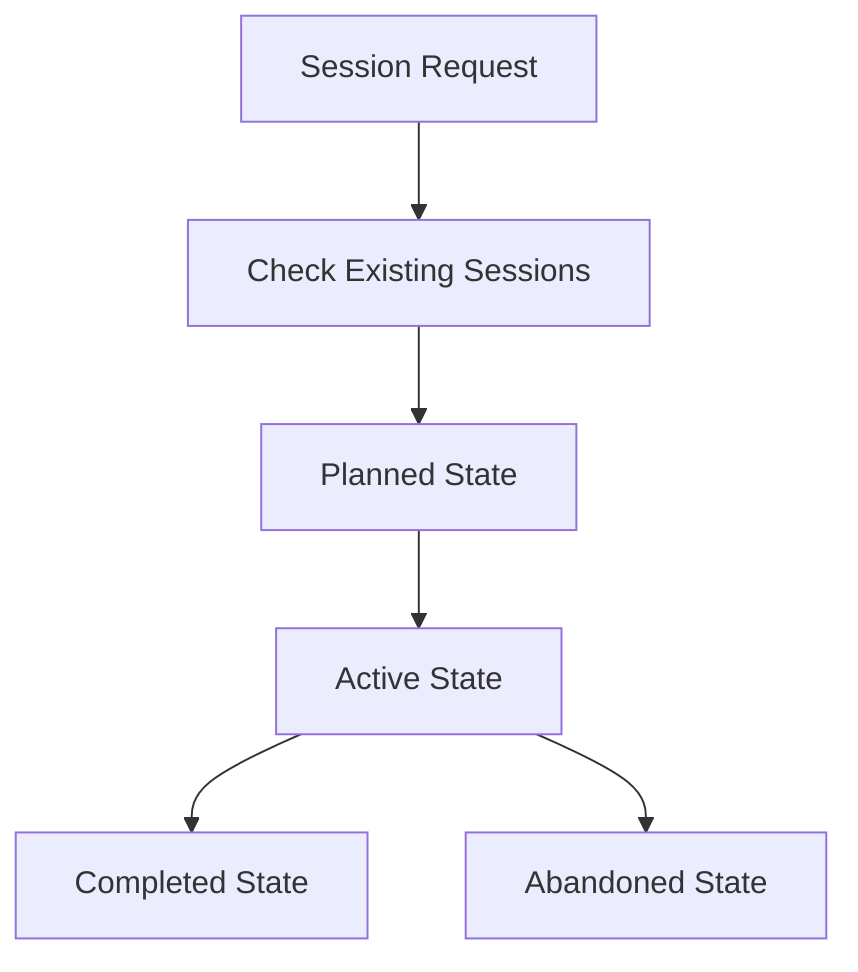
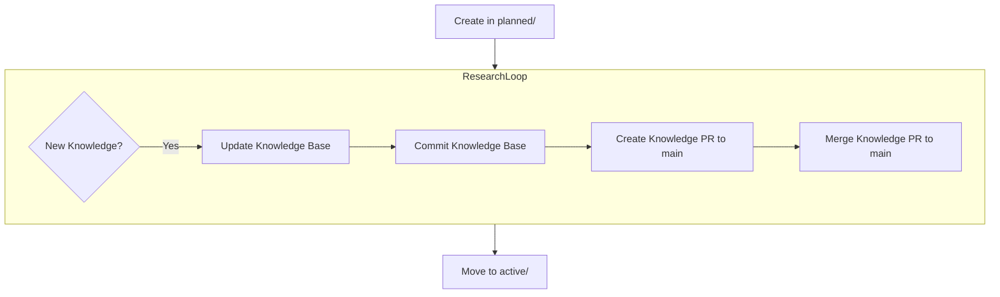
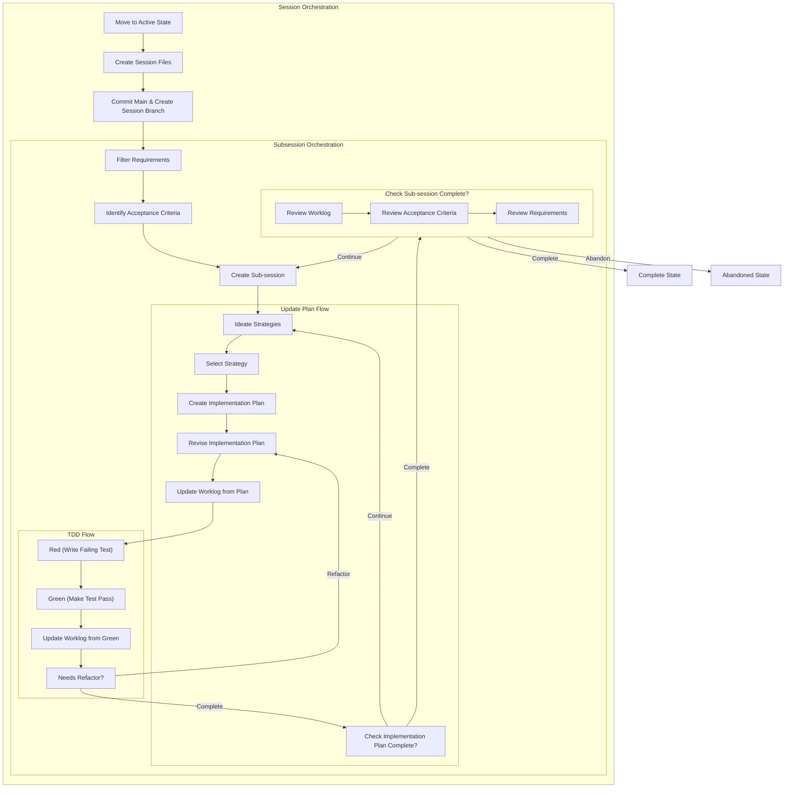
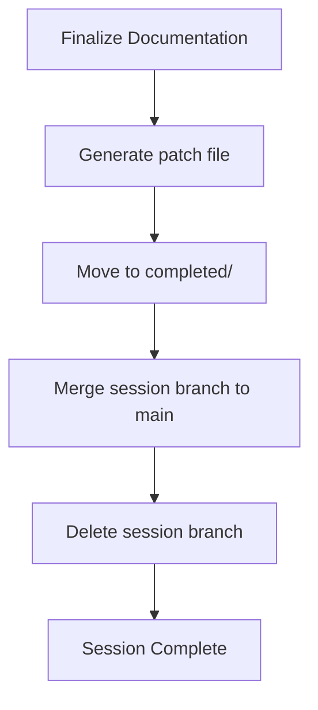
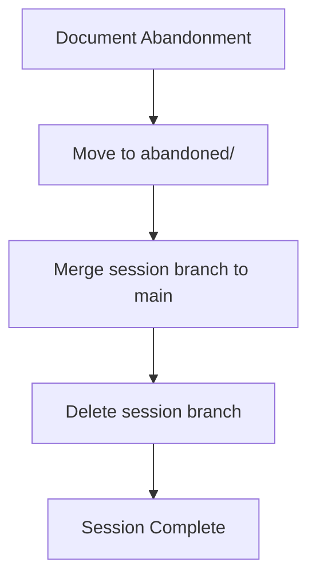

# Agent Sessions Directory

This directory contains organized session folders for tracking agent work across different states and purposes.

## Directory Structure

```
sessions/
├── active/          # Currently active sessions
├── completed/       # Finished sessions
├── planned/         # Future sessions
├── abandoned/       # Cancelled/incomplete sessions
└── SESSIONS-README.md        # This file
```

## Session Folder Naming Convention

All session folders follow this pattern:
```
YYYY-MM-DD-descriptive-slug
```

⚠️ Use system time functions as needed to orient yourself temporally.

**Examples:**
- `2024-12-19-comfyui-ubuntu25-rocm-install`
- `2024-12-20-docker-compose-setup`
- `2024-12-21-security-hardening`

## Session Contents

Each session folder should contain:

### Required Files
- **`SESSION.md`** - Core session documentation
  - Context: What the session is about
  - Acceptance Criteria: Success metrics
  - Original Implementation Plan: Initial approach

### Active Session Files
- **`worklog.md`** - Progress tracking (like Jira comments)
  - Session overview and status
  - Work log entries with timestamps
  - Decisions, issues, and solutions
  - Next steps

- **`active-plan.md`** - Dynamic implementation plan
  - Current status and currentsubsession tracking
  - Checkbox-based task lists
  - Issues and blockers section
  - Lessons learned
  - Next actions

- **`subsessions.md`** - Sub-sessions
  - Subsessions list
  - Subsession status

- **`{{session-slug}}.patch`** - Final patch file, generated after session is complete

## Session Lifecycle Overview



## Individual State Flowcharts

### Planned State Flowchart



### Active State Flowchart



### Completed State Flowchart



### Abandoned State Flowchart



## Trunk-Based Development Integration

### Session Branch Strategy
- **Session Branch**: Each session gets its own branch (`session/YYYY-MM-DD-descriptive-slug`)
- **Sub-sessions**: Break down epic-level sessions into smaller, mergeable sub-sessions
- **Frequent Merges**: Sub-sessions are merged to main frequently (daily or per sub-session)
- **Session Branch**: Remains for the entire session duration, can be used for patches

### Sub-session Workflow
1. **Work on sub-session** in session branch
2. **Commit code changes** (`git add src/ && git commit`)
3. **Check if tests pass** (custom tests as needed)
4. **Update session files** and commit (`git add sessions/ && git commit`)
5. **Update knowledge base** and commit (`git add _AGENTS/knowledge/ && git commit`)
6. **Create PR** from session branch to main ONLY IF THERE IS AN UPSTREAM REMOTE
7. **Squash merge PR** to main (trunk-based) - keeps main history clean
8. **Continue** with next sub-session

### Session Completion
- **Final merge**: Session branch squash merged to main
- **Cleanup**: Session branch can be deleted or kept for reference
- **Documentation**: Session files moved to completed/

### Commit Strategy
- **Code Changes**: `git add src/ && git commit -m "feat: implement feature"`
- **Session Files**: `git add sessions/ && git commit -m "docs: update session worklog"`
- **Knowledge Base**: `git add _AGENTS/knowledge/ && git commit -m "docs: add patterns"`
- **Avoid**: `git add .` - be specific about what you're committing

### Squash Merge Benefits
- **Clean History**: Main branch shows logical units of work, not individual commits
- **Session Isolation**: Each session appears as a single commit on main
- **Easy Rollback**: Can revert entire sessions if needed
- **Clear Attribution**: Session identifier in commit message shows which session

### Branch Naming Convention
- **Session Branch**: `session/YYYY-MM-DD-descriptive-slug`
- **Sub-session Commits**: Include sub-session identifier in commit messages
- **PR Titles**: `[session: YYYY-MM-DD-descriptive-slug] Sub-session description`

## Best Practices

1. **Update frequently** - don't let documentation lag behind work
2. **Document decisions** - future agents need context
3. **Be honest** - document failures and lessons learned
4. **Clean up** - remove temporary files when done

## Session States

| State | Location | Description |
|-------|----------|-------------|
| **Planned** | `planned/` | Future work, research phase |
| **Active** | `active/` | Currently being worked on |
| **Completed** | `completed/` | Successfully finished |
| **Abandoned** | `abandoned/` | Cancelled or incomplete |
