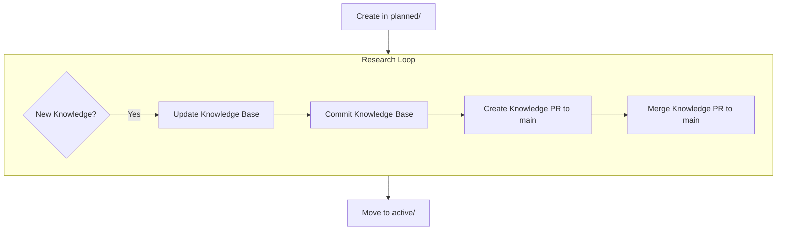
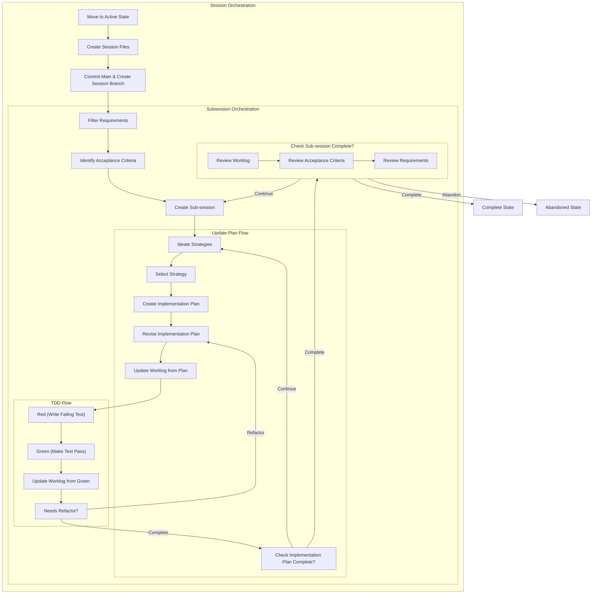
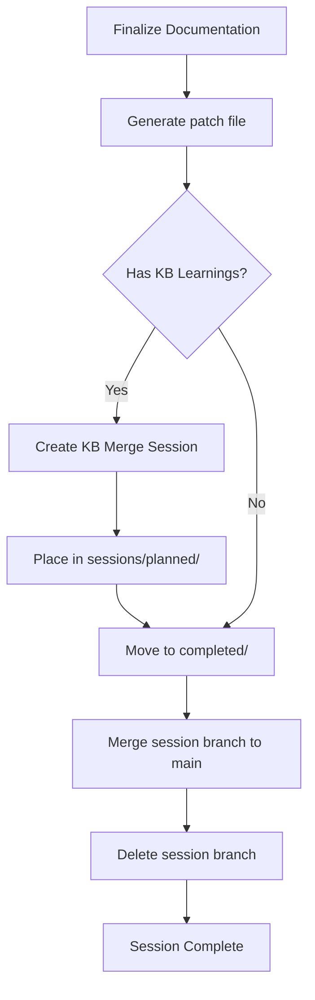
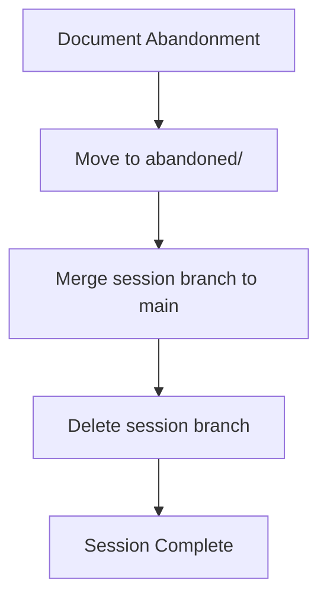

# Sessions Protocol Reference

This document contains detailed examples, git commands, troubleshooting guides, and edge case handling for the multi-agent session protocol.

> **📖 For essential protocol overview:** See [SESSIONS-README.md](SESSIONS-README.md)

## Table of Contents

- [Utility Scripts](#utility-scripts)
- [Git Worktrees Setup](#git-worktrees-setup)
- [Agent Registry](#agent-registry)
- [Session Claim and Activation](#session-claim-and-activation)
- [Detailed State Flowcharts](#detailed-state-flowcharts)
- [KB Merge Session Template](#kb-merge-session-template)
- [Conflict Resolution Examples](#conflict-resolution-examples)
- [Traceability & Auditing](#traceability--auditing)
- [Directory Structure Example](#directory-structure-example)

---

## Utility Scripts

The `_bin/` directory contains executable scripts for common session operations:

### claim-session

Claims and activates a session atomically.

**Usage:**
```bash
./_bin/claim-session <agent-id> <session-slug>
```

**Example:**
```bash
./_bin/claim-session cursor-1 2025-10-14-auth-system

# Then activate:
cd sessions/active/2025-10-14-auth-system
source .session-env
```

**What it does:**
1. Pulls latest git state
2. Checks session availability
3. Claims session atomically via git push
4. Moves session to `active/`
5. Creates `.session-env` file
6. Creates session branch
7. Provides activation instructions

### complete-session

Completes a session and merges to main.

**Usage:**
```bash
./_bin/complete-session <agent-id> <session-slug>
```

**Example:**
```bash
# From repo root
./_bin/complete-session cursor-1 2025-10-14-auth-system
```

**What it does:**
1. Generates patch file
2. Creates KB merge session if learnings exist
3. Moves session to `completed/`
4. Merges to main via squash merge
5. Deletes session branch
6. Reminds you to deactivate environment

---

## Git Worktrees Setup (Optional)

Worktrees are **optional infrastructure** for running multiple sessions concurrently. They're not required for the protocol to work.

### Recommended Structure

Keep worktrees organized in a subdirectory to avoid clutter:

```bash
# Main repo
cd /path/to/repo

# Create worktrees directory
mkdir -p ../repo-worktrees

# Create worktrees in organized location
git worktree add ../repo-worktrees/agent-1 main
git worktree add ../repo-worktrees/agent-2 main
git worktree add ../repo-worktrees/agent-3 main

# Result:
# /path/to/repo/              # Main repo
# /path/to/repo-worktrees/    # Worktrees container
#   ├── agent-1/
#   ├── agent-2/
#   └── agent-3/
```

### Worktree Cleanup

When a session completes, optionally remove the worktree if no longer needed:

```bash
# After session completion
git worktree remove ../repo-worktrees/agent-1

# Or prune all deleted worktrees
git worktree prune
```

**Benefits:**
- Shared `.git` directory (efficient disk usage)
- Isolated working directories (no file conflicts)
- Can run multiple sessions concurrently
- All see same git history
- Clean organization (not scattered in parent dir)

**Limitations:**
- Can't checkout same branch in multiple worktrees
- Must use unique branch names per session

**Alternative:** Work sequentially in main repo (one session at a time)

---

## Agent Registry

### Registry Structure

```
.agents/
├── sessions.lock        # Session claims (format: agent-id:session-slug:timestamp)
└── agents/
    ├── cursor-1.json    # Agent status and metadata
    ├── claude-a.json
    └── agent-3.json
```

### Agent Status File Example

```json
{
  "id": "cursor-1",
  "type": "cursor-local",
  "started": "2025-10-14T10:30:00Z",
  "status": "active",
  "current_session": "2025-10-14-auth-system",
  "worktree": "/path/to/repo-cursor-1"
}
```

### Session Lock File Format

```
cursor-1:2025-10-14-auth-system:1697283000
claude-a:2025-10-14-api-work:1697283100
cursor-1:kb-2025-10-14-merge-auth-patterns:1697284000
```

Each line: `{agent-id}:{session-slug}:{unix-timestamp}`

---

## Session Claim and Activation

### Complete Implementation

```bash
#!/bin/bash
# Session claim script

AGENT_ID="cursor-1"
SESSION_SLUG="2025-10-14-auth-system"

# Step 1: Pull latest state
echo "Pulling latest state..."
git pull --rebase origin main

# Step 2: Check if session already claimed
if grep -q "$SESSION_SLUG" .agents/sessions.lock; then
  echo "❌ Session already claimed by another agent"
  echo "Available sessions:"
  ls sessions/planned/
  exit 1
fi

# Step 3: Check if session exists
if [ ! -d "sessions/planned/$SESSION_SLUG" ]; then
  echo "❌ Session does not exist in planned/"
  exit 1
fi

# Step 4: Claim session atomically
TIMESTAMP=$(date +%s)
echo "$AGENT_ID:$SESSION_SLUG:$TIMESTAMP" >> .agents/sessions.lock
git add .agents/sessions.lock
git commit -m "[$AGENT_ID] Claim session $SESSION_SLUG"

# Step 5: Push (atomic operation)
if git push origin main; then
  echo "✅ Session claimed successfully"
  
  # Step 6: Move session to active
  mv sessions/planned/$SESSION_SLUG sessions/active/
  
  # Step 7: Create session activation file
  cat > sessions/active/$SESSION_SLUG/.session-env << EOF
export GIT_AUTHOR_NAME="Agent-$AGENT_ID (via $(git config user.name))"
export GIT_AUTHOR_EMAIL="$(git config user.email)+$AGENT_ID@agents.local"
export GIT_COMMITTER_NAME="Agent-$AGENT_ID (via $(git config user.name))"
export GIT_COMMITTER_EMAIL="$(git config user.email)+$AGENT_ID@agents.local"
export SESSION_AGENT="$AGENT_ID"
export SESSION_SLUG="$SESSION_SLUG"
export SESSION_BRANCH="session/$AGENT_ID/$SESSION_SLUG"
export PS1="($AGENT_ID:$SESSION_SLUG) \w $ "
echo "✅ Session active: $SESSION_AGENT/$SESSION_SLUG"
EOF
  
  git add sessions/
  git commit -m "[$AGENT_ID] Move session to active and create activation"
  
  # Step 8: Create session branch and activate
  git checkout -b session/$AGENT_ID/$SESSION_SLUG
  cd sessions/active/$SESSION_SLUG
  source .session-env
  
  # Session is now active with proper git identity
else
  echo "❌ Push failed - another agent claimed session first"
  echo "Rolling back..."
  git reset --hard HEAD~1
  echo "Try claiming a different session"
  exit 1
fi
```

### Handling Race Conditions

```bash
# Manual recovery if claim push fails

# 1. Pull to get latest state
git pull --rebase origin main

# 2. Check what sessions are now claimed
cat .agents/sessions.lock

# 3. Clean up your failed claim attempt
grep -v "cursor-1:2025-10-14-auth" .agents/sessions.lock > temp
mv temp .agents/sessions.lock

# 4. Try claiming a different session
echo "cursor-1:2025-10-14-api-work:$(date +%s)" >> .agents/sessions.lock
git add .agents/sessions.lock
git commit -m "[cursor-1] Claim api-work session"
git push origin main
```

---

## Detailed State Flowcharts

### Planned State Flowchart



### Active State Flowchart



### Completed State Flowchart



### Abandoned State Flowchart



---

## KB Merge Session Template

Auto-generated template when completing sessions with learnings:

```markdown
# KB Merge Session: {Topic}

## Context

This session merges knowledge base learnings from a completed session.

- **Source Session**: 2025-10-14-auth-system
- **Source Agent**: Cursor-Local-1
- **Completed**: 2025-10-14T15:30:00Z
- **Learnings Path**: `_AGENTS/knowledge/sessions/2025-10-14-auth-system/learnings.md`

## Acceptance Criteria

- [ ] Review learnings for quality and accuracy
- [ ] Identify target location(s) in `knowledge/shared/`
- [ ] Merge without duplicating existing content
- [ ] Resolve conflicts with existing KB entries
- [ ] Update KB structure if needed (add sections, reorganize)
- [ ] Preserve source learnings file for reference
- [ ] Document merge decisions in worklog
- [ ] Update KB index/TOC if exists

## Original Implementation Plan

### Phase 1: Review
1. Read source learnings from completed session
2. Read existing KB files that may overlap
3. Identify conflicts, duplications, and gaps

### Phase 2: Merge Strategy
1. Determine merge approach:
   - **Augment**: Add to existing KB section
   - **Create**: Create new KB section
   - **Restructure**: Reorganize KB for better flow
2. Document strategy in worklog

### Phase 3: Execute Merge
1. Apply changes to `knowledge/shared/`
2. Test KB coherence:
   - No broken links
   - Consistent style and formatting
   - Logical organization
3. Update KB index/TOC

### Phase 4: Complete
1. Commit KB changes to session branch
2. Create PR to main with clear KB diff
3. Mark KB session complete
```

### KB Merge Workflow Example

```bash
# Agent picks up KB merge session
cd sessions/active/claude-a/kb-2025-10-14-merge-auth-patterns

# 1. Read source learnings
cat _AGENTS/knowledge/sessions/2025-10-14-auth-system/learnings.md

# 2. Read existing canonical KB
cat _AGENTS/knowledge/shared/apis/auth.md

# 3. Determine merge strategy (document in worklog)
cat >> worklog.md << 'EOF'
## [2025-10-14 16:00] Merge Strategy

**Source learnings cover:**
- JWT token validation patterns
- Session management best practices
- Security considerations for token refresh

**Existing KB has:**
- Basic auth concepts
- OAuth2 flow
- Missing: JWT specifics

**Strategy:** Augment existing auth.md with new JWT section
**Location:** knowledge/shared/apis/auth.md (new section at end)
EOF

# 4. Apply merge
cat >> _AGENTS/knowledge/shared/apis/auth.md << 'EOF'

## JWT Token Patterns

### Token Validation
[Content from learnings...]

### Session Management
[Content from learnings...]
EOF

# 5. Commit
git add _AGENTS/knowledge/shared/apis/auth.md
git add worklog.md
git commit -m "[claude-a] Merge JWT learnings to canonical KB"

# 6. Complete session (standard completion flow)
```

---

## Conflict Resolution Examples

### Example 1: Session Claim Race Condition

**Scenario:** Two agents try to claim the same session simultaneously.

```bash
# Agent cursor-1 (executes first)
git pull origin main
echo "cursor-1:2025-10-14-auth:$(date +%s)" >> .agents/sessions.lock
git add .agents/sessions.lock
git commit -m "[cursor-1] Claim auth session"
git push origin main  # ✅ Success

# Agent claude-a (executes second)
git pull origin main
echo "claude-a:2025-10-14-auth:$(date +%s)" >> .agents/sessions.lock
git add .agents/sessions.lock
git commit -m "[claude-a] Claim auth session"
git push origin main  # ❌ Fails - rejected (non-fast-forward)

# Agent claude-a recovery
git pull --rebase origin main  # Gets cursor-1's claim
cat .agents/sessions.lock      # See that auth is claimed

# Clean up failed attempt
git reset --hard origin/main

# Pick different session
echo "claude-a:2025-10-14-api-work:$(date +%s)" >> .agents/sessions.lock
git add .agents/sessions.lock
git commit -m "[claude-a] Claim api-work session"
git push origin main  # ✅ Success
```

### Example 2: Code Conflict During Merge

**Scenario:** Two agents modified the same function.

```bash
# Agent cursor-1 merging session to main
git checkout main
git pull origin main
git merge --squash session/cursor-1/2025-10-14-feature-x

# Conflict detected in src/api.js
Auto-merging src/api.js
CONFLICT (content): Merge conflict in src/api.js

# View conflict
cat src/api.js
<<<<<<< HEAD
function handleRequest(req) {
  // claude-a's version (already on main)
  return validateAndProcess(req);
}
=======
function handleRequest(req) {
  // cursor-1's version (from session)
  return processAndValidate(req);
}
>>>>>>> session/cursor-1/2025-10-14-feature-x

# Resolve: Keep cursor-1's changes (session focus)
# Edit src/api.js to use processAndValidate

# Document in worklog
cat >> sessions/active/2025-10-14-feature-x/worklog.md << 'EOF'

## [2025-10-14 15:30] Merge Conflict Resolution

**File**: src/api.js
**Function**: handleRequest()
**Conflict**: Both cursor-1 and claude-a modified this function
**Resolution**: Kept cursor-1's processAndValidate() approach
**Rationale**: 
- Session focus was on request processing flow
- claude-a's validateAndProcess() addressed different concern (validation order)
- Extracted claude-a's validation logic to separate validator module
**Follow-up**: Session to refactor validation strategy needed

EOF

# Complete merge
git add src/api.js sessions/
git commit -m "[cursor-1] Resolve merge conflict in handleRequest"
git push origin main
```

### Example 3: KB Learnings Overlap

**Scenario:** Two agents learned about the same API independently.

```
knowledge/sessions/
├── 2025-10-14-cursor-1-auth/learnings.md
│   - JWT validation patterns
│   - Token refresh strategies
└── 2025-10-14-claude-a-api/learnings.md
    - JWT security best practices
    - Token expiration handling
```

**Resolution:** KB merge sessions handle this:

```bash
# First KB merge session (cursor-1's learnings)
# Creates: knowledge/shared/apis/auth.md with JWT section

# Second KB merge session (claude-a's learnings)
# Agent reviews existing KB and learnings
cat _AGENTS/knowledge/shared/apis/auth.md  # See JWT section exists
cat _AGENTS/knowledge/sessions/2025-10-14-claude-a-api/learnings.md

# Strategy: Augment existing with security section
# Document in worklog
cat >> worklog.md << 'EOF'
## Merge Strategy

Existing KB (from cursor-1) covers JWT validation and refresh.
New learnings (claude-a) add security best practices.

**Action:** Add "JWT Security" subsection to existing JWT section
**No conflicts:** Complementary information
EOF

# Apply merge
# Add security subsection to knowledge/shared/apis/auth.md
# Commit as usual
```

---

## Traceability & Auditing

### Agent Attribution Queries

```bash
# View all commits by specific agent
git log --author="Cursor-Local-1" --oneline
git log --author="Claude-Cloud-A" --oneline

# See agent activity summary (commit count)
git shortlog -sn --author="Agent"

# Find who last modified a file
git blame src/api.js

# View agent's work on specific file
git log --author="cursor-1" --oneline -- src/auth.js

# See all sessions completed by agent
git log --author="Claude-Cloud-A" --grep="Session complete" --oneline

# Find all KB merges by agent
git log --author="cursor-1" --grep="KB merge" --oneline

# View commits in date range
git log --author="Cursor-Local-1" --since="2025-10-01" --until="2025-10-14"

# See what agent changed in specific commit
git show <commit-hash> --stat
```

### Rollback Strategies

```bash
# Revert entire session (find merge commit first)
git log --oneline --grep="2025-10-14-auth-system"
# Output: abc1234 [cursor-1] Session complete: 2025-10-14-auth-system
git revert abc1234

# Revert all changes by specific agent to a file
git log --author="Cursor-Local-1" --format="%H" -- src/api.js | xargs -I {} git revert {}

# Undo agent's last N commits (use with caution - may affect other work)
git log --author="claude-a" -n 5 --format="%H" | xargs -I {} git revert {}

# Cherry-pick good commits from abandoned session
git log session/cursor-1/2025-10-14-abandoned --oneline
# Pick specific commits
git cherry-pick <commit-hash>

# Undo specific file changes from session
git checkout origin/main -- src/problem-file.js
git commit -m "[manual] Revert problem-file.js from session"

# View what would be reverted (dry run)
git revert --no-commit abc1234
git status  # See what would change
git reset --hard  # Abort dry run
```

### Audit Reports

```bash
# Agent productivity report (commits per agent)
git log --all --format="%aN" | sort | uniq -c | sort -rn
# Output:
#   45 Cursor-Local-1 (via cristos)
#   32 Claude-Cloud-A (via cristos)
#   18 Copilot-WSL-1 (via cristos)

# Session completion rate by agent
git log --all --grep="Session complete" --format="%aN" | sort | uniq -c
# Output:
#   12 Cursor-Local-1 (via cristos)
#    8 Claude-Cloud-A (via cristos)

# KB contributions by agent
git log --all --grep="KB merge" --format="%aN" | sort | uniq -c

# Files most frequently modified by agent
git log --author="cursor-1" --name-only --format="" | sort | uniq -c | sort -rn
# Output:
#   15 src/api.js
#   12 src/auth.js
#    8 src/utils.js

# Agent's most active days
git log --author="Claude-Cloud-A" --format="%ad" --date=short | sort | uniq -c | sort -rn
# Output:
#   12 2025-10-14
#    8 2025-10-13
#    5 2025-10-12

# Lines added/removed by agent
git log --author="cursor-1" --numstat --format="" | awk '{added+=$1; removed+=$2} END {print "Added:", added, "Removed:", removed}'

# Agent collaboration matrix (files both touched)
comm -12 \
  <(git log --author="cursor-1" --name-only --format="" | sort | uniq) \
  <(git log --author="claude-a" --name-only --format="" | sort | uniq)
```

---

## Directory Structure Example

Complete repository layout with multi-agent support:

```
/repo/
├── .agents/
│   ├── sessions.lock           # Session claims
│   │   # Format: agent-id:session-slug:timestamp
│   │   # cursor-1:2025-10-14-auth-system:1697283000
│   │   # claude-a:2025-10-14-api-work:1697283100
│   │
│   └── agents/
│       ├── cursor-1.json       # Agent status
│       ├── claude-a.json
│       └── agent-3.json
│
├── _AGENTS/
│   ├── knowledge/
│   │   ├── shared/             # Canonical KB (main branch only)
│   │   │   ├── apis/
│   │   │   │   ├── auth.md
│   │   │   │   └── payments.md
│   │   │   ├── patterns/
│   │   │   │   ├── error-handling.md
│   │   │   │   └── state-management.md
│   │   │   ├── systems/
│   │   │   │   └── architecture.md
│   │   │   └── index.md
│   │   │
│   │   └── sessions/           # Session-scoped learnings
│   │       ├── 2025-10-14-auth-system/
│   │       │   └── learnings.md
│   │       ├── 2025-10-14-api-work/
│   │       │   └── learnings.md
│   │       └── 2025-10-13-initial-setup/
│   │           └── learnings.md
│   │
│   └── sessions/
│       ├── _bin/               # Utility scripts
│       │   ├── claim-session
│       │   └── complete-session
│       │
│       ├── _templates/         # Templates
│       │   ├── kb-merge-SESSION.md
│       │   └── session-env.template
│       │
│       ├── SESSIONS-README.md      # Essential protocol
│       ├── SESSIONS-REFERENCE.md   # This file
│       │
│       ├── abandoned/
│       │   └── 2025-10-11-failed-approach/
│       │       ├── SESSION.md
│       │       └── worklog.md
│       │
│       ├── active/             # Active sessions
│       │   ├── 2025-10-14-auth-system/
│       │   │   ├── .session-env      # Session activation
│       │   │   ├── SESSION.md
│       │   │   ├── worklog.md
│       │   │   ├── active-plan.md
│       │   │   └── subsessions.md
│       │   │
│       │   └── 2025-10-14-api-work/
│       │       ├── .session-env      # Session activation
│       │       ├── SESSION.md
│       │       ├── worklog.md
│       │       └── active-plan.md
│       │
│       ├── completed/          # Finished and merged
│       │   ├── 2025-10-13-initial-setup/
│       │   │   ├── SESSION.md
│       │   │   ├── worklog.md
│       │   │   └── 2025-10-13-initial-setup.patch
│       │   │
│       │   └── 2025-10-12-database-schema/
│       │       ├── SESSION.md
│       │       ├── worklog.md
│       │       └── 2025-10-12-database-schema.patch
│       │
│       ├── drafting/           # Being defined
│       │   └── 2025-10-17-new-idea/
│       │       └── SESSION.md (incomplete)
│       │
│       └── planned/            # Ready to claim
│           ├── 2025-10-15-new-feature/
│           │   └── SESSION.md
│           ├── kb-2025-10-14-merge-auth-patterns/
│           │   └── SESSION.md
│           └── 2025-10-16-refactor-api/
│               └── SESSION.md
│
├── src/                        # Your application code
│   ├── api.js
│   ├── auth.js
│   └── utils.js
│
├── tests/
│   └── ...
│
└── README.md

# Worktree layout (if using worktrees)
/repo/                          # Main repo
/repo-worktrees/                # Worktrees container
  ├── agent-1/                  # First agent worktree
  ├── agent-2/                  # Second agent worktree
  └── agent-3/                  # Additional agent worktree
```

---

## Quick Reference

### Complete Session Start

```bash
#!/bin/bash
# Complete session start script

AGENT_ID="cursor-1"
SESSION_SLUG="2025-10-14-auth-system"
USER_NAME=$(git config user.name)
USER_EMAIL=$(git config user.email)

# Pull latest
git pull origin main

# Claim session
echo "$AGENT_ID:$SESSION_SLUG:$(date +%s)" >> .agents/sessions.lock
git add .agents/sessions.lock
git commit -m "[$AGENT_ID] Claim session $SESSION_SLUG"

if git push origin main; then
  # Move to active
  mv sessions/planned/$SESSION_SLUG sessions/active/
  
  # Create session activation file
  cat > sessions/active/$SESSION_SLUG/.session-env << EOF
export GIT_AUTHOR_NAME="Agent-$AGENT_ID (via $USER_NAME)"
export GIT_AUTHOR_EMAIL="$USER_EMAIL+$AGENT_ID@agents.local"
export GIT_COMMITTER_NAME="Agent-$AGENT_ID (via $USER_NAME)"
export GIT_COMMITTER_EMAIL="$USER_EMAIL+$AGENT_ID@agents.local"
export SESSION_AGENT="$AGENT_ID"
export SESSION_SLUG="$SESSION_SLUG"
export PS1="($AGENT_ID:$SESSION_SLUG) \w $ "
echo "✅ Session active: \$SESSION_AGENT/\$SESSION_SLUG"
EOF
  
  git add sessions/
  git commit -m "[$AGENT_ID] Move session to active and create activation"
  git push origin main
  
  # Create branch and activate
  git checkout -b session/$AGENT_ID/$SESSION_SLUG
  cd sessions/active/$SESSION_SLUG
  source .session-env
  
  # Ready to work with session context active
else
  echo "❌ Claim failed, rolling back"
  git reset --hard HEAD~1
  exit 1
fi
```

### Complete Session Completion

```bash
#!/bin/bash
# Complete session completion script

AGENT_ID="cursor-1"
SESSION_SLUG="2025-10-14-auth-system"

# 1. Generate patch
cd sessions/active/$SESSION_SLUG
git format-patch main --stdout > $SESSION_SLUG.patch

# 2. Check for KB learnings
if [ -f "_AGENTS/knowledge/sessions/$SESSION_SLUG/learnings.md" ]; then
  # Extract topic from learnings
  TOPIC=$(head -1 _AGENTS/knowledge/sessions/$SESSION_SLUG/learnings.md | sed 's/# //')
  KB_SESSION="kb-$(date +%Y-%m-%d)-merge-${TOPIC// /-}"
  
  # Create KB merge session
  mkdir -p sessions/planned/$KB_SESSION
  cat > sessions/planned/$KB_SESSION/SESSION.md << EOF
# KB Merge Session: $TOPIC

## Context
- **Source Session**: $SESSION_SLUG
- **Agent**: $AGENT_ID
- **Learnings Path**: _AGENTS/knowledge/sessions/$SESSION_SLUG/learnings.md

## Acceptance Criteria
- [ ] Review learnings
- [ ] Merge to knowledge/shared/
- [ ] Resolve conflicts
- [ ] Update KB index

## Original Implementation Plan
1. Review source learnings and existing KB
2. Determine merge strategy
3. Apply changes
4. Commit and complete
EOF
  
  git add sessions/planned/$KB_SESSION/
  git commit -m "[$AGENT_ID] Create KB merge session"
fi

# 3. Move to completed and deactivate
cd ../../..  # Back to repo root
mv sessions/active/$SESSION_SLUG sessions/completed/
git add sessions/
git commit -m "[$AGENT_ID] Complete session $SESSION_SLUG"

# 4. Merge to main
git checkout main
git pull origin main
git merge --squash session/$AGENT_ID/$SESSION_SLUG
git commit -m "[$AGENT_ID] Session complete: $SESSION_SLUG"
git push origin main

# 5. Cleanup and deactivate
git branch -d session/$AGENT_ID/$SESSION_SLUG
unset GIT_AUTHOR_NAME GIT_AUTHOR_EMAIL GIT_COMMITTER_NAME GIT_COMMITTER_EMAIL
unset SESSION_AGENT SESSION_SLUG SESSION_BRANCH PS1

echo "✅ Session complete! Session context deactivated."
```

---

## Troubleshooting

### Session claim keeps failing

**Problem:** Every time you try to claim a session, push fails.

**Solution:**
```bash
# Check if you're up to date
git pull --rebase origin main

# Check what's in sessions.lock
cat .agents/sessions.lock

# If your agent ID appears multiple times
grep "your-agent-id" .agents/sessions.lock

# Clean up stale claims
grep -v "your-agent-id:old-session" .agents/sessions.lock > temp
mv temp .agents/sessions.lock
git add .agents/sessions.lock
git commit -m "[your-agent-id] Clean up stale claims"
git push origin main
```

### KB learnings not being created

**Problem:** Working on session but no learnings file.

**Solution:**
```bash
# Create learnings file during session
mkdir -p _AGENTS/knowledge/sessions/$(basename $(pwd))
cat > _AGENTS/knowledge/sessions/$(basename $(pwd))/learnings.md << 'EOF'
# Session Learnings

## Topic Area

### Key Insights

### Patterns Discovered

### Gotchas & Edge Cases

EOF

git add _AGENTS/knowledge/sessions/
git commit -m "[your-agent-id] Initialize session learnings"
```

### Merge conflicts in session files

**Problem:** Merging session to main causes conflicts in worklog or active-plan.

**Solution:**
```bash
# Session files conflicts: always keep your version
git checkout --ours sessions/active/your-session/worklog.md
git add sessions/
git commit -m "[your-agent-id] Resolve session files conflict"
```

Session files are agent-specific and shouldn't conflict if namespaced correctly. If they do, it means directory structure issue.

### Agent identity not showing in git log

**Problem:** Commits show wrong author or generic name.

**Solution:**
```bash
# Check if session is activated
echo $GIT_AUTHOR_NAME
echo $SESSION_AGENT

# If not set, activate session
cd sessions/active/your-session/
source .session-env

# Verify activation
echo $GIT_AUTHOR_NAME  # Should show: Agent-your-id (via username)
echo $SESSION_AGENT    # Should show: your-agent-id

# If commits already made with wrong identity, amend last commit
git commit --amend --reset-author --no-edit
```

**Cause:** Session not activated before committing. Always `source .session-env` before working.

---

**📚 For essential protocol overview, return to [SESSIONS-README.md](SESSIONS-README.md)**

