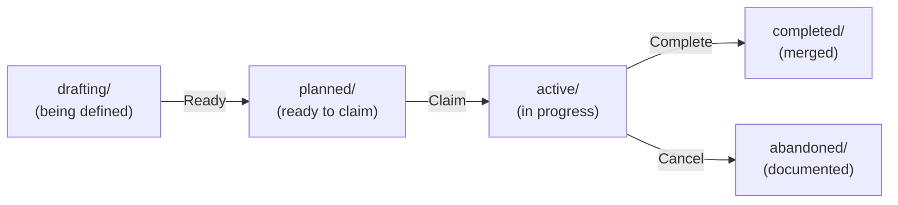
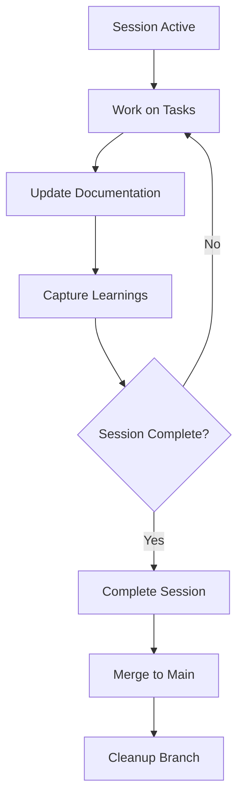
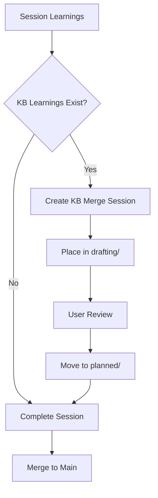

# Sessions Protocol Reference

This document provides detailed implementation guidance, examples, and troubleshooting for the multi-agent session protocol.

> **📖 For essential protocol overview:** See [SESSIONS-README.md](SESSIONS-README.md)

## Table of Contents

- [Utility Scripts](#utility-scripts)
- [Session Templates](#session-templates)
- [Detailed Implementation Examples](#detailed-implementation-examples)
- [Git Worktrees Setup](#git-worktrees-setup)
- [Agent Registry & Session Lock](#agent-registry--session-lock)
- [State Flowcharts](#state-flowcharts)
- [Conflict Resolution Examples](#conflict-resolution-examples)
- [Troubleshooting](#troubleshooting)
- [Audit & Traceability](#audit--traceability)

---

## Utility Scripts

The `_bin/` directory contains executable scripts for common session operations.

### claim-session

Claims and activates a session atomically.

**Usage:**
```bash
./_bin/claim-session <session-slug>
```

**Example:**
```bash
./_bin/claim-session 2025-10-14-auth-system
```

**What it does:**
1. Pulls latest git state
2. Checks session availability in `.agents/sessions.lock`
3. Claims session atomically via git push
4. Moves session from `planned/` to `active/`
5. Creates `.session-env` file with session identity
6. Creates session branch `session/{session-slug}`
7. Provides activation instructions

**Environment Variables Set:**
- `GIT_AUTHOR_NAME` - Agent-specific git author
- `GIT_AUTHOR_EMAIL` - Agent-specific git email
- `SESSION_SLUG` - Session identifier
- `SESSION_BRANCH` - Session branch name
- `PS1` - Updated shell prompt

### complete-session

Completes a session and merges to main.

**Usage:**
```bash
./_bin/complete-session <session-slug>
```

**Example:**
```bash
./_bin/complete-session 2025-10-14-auth-system
```

**What it does:**
1. Generates patch file in session directory (`{session-slug}.patch`)
2. Checks for KB learnings and creates KB merge session in `drafting/` if found
3. Moves session from `active/` to `completed/`
4. Merges session branch to main via squash merge
5. Deletes session branch
6. Reminds to deactivate environment variables

**KB Merge Session Creation:**
- Automatically creates `kb-{date}-merge-{topic}` session if learnings exist
- Uses template from `_templates/kb-merge-SESSION.md`
- Places in `sessions/drafting/` for user review before moving to `planned/`

---

## Session Templates

The `_templates/` directory contains templates for session files.

### kb-merge-SESSION.md

Template for KB merge sessions created automatically when completing sessions with learnings.

**Template Variables:**
- `{{TOPIC}}` - Extracted from learnings file first heading
- `{{SOURCE_SESSION}}` - Original session slug
- `{{AGENT_ID}}` - Agent that completed source session
- `{{TIMESTAMP}}` - Completion timestamp

**Usage:**
```bash
# Automatically used by complete-session script
# Manual creation if needed:
sed -e "s/{{SOURCE_SESSION}}/2025-10-14-auth-system/g" \
    -e "s/{{AGENT_ID}}/cursor-1/g" \
    -e "s/{{TOPIC}}/auth-patterns/g" \
    "_templates/kb-merge-SESSION.md" > "sessions/planned/kb-2025-10-14-merge-auth-patterns/SESSION.md"
```

### session-env.template

Template for session environment files.

**Template Variables:**
- `{{AGENT_ID}}` - Agent identifier
- `{{SESSION_SLUG}}` - Session identifier
- `{{USER_NAME}}` - Git user name
- `{{USER_EMAIL}}` - Git user email

**Usage:**
```bash
# Automatically used by claim-session script
# Manual creation if needed:
sed -e "s/{{AGENT_ID}}/cursor-1/g" \
    -e "s/{{SESSION_SLUG}}/2025-10-14-auth-system/g" \
    -e "s/{{USER_NAME}}/$(git config user.name)/g" \
    -e "s/{{USER_EMAIL}}/$(git config user.email)/g" \
    "_templates/session-env.template" > "sessions/active/2025-10-14-auth-system/.session-env"
```

---

## Detailed Implementation Examples

### Complete Session Workflow

#### Starting a Session

```bash
# 1. Claim and activate session
./_bin/claim-session 2025-10-14-auth-system

# 2. Activate session environment
cd sessions/active/2025-10-14-auth-system
source .session-env

# 3. Verify activation
echo $GIT_AUTHOR_NAME  # Should show: Agent-cursor-1 (via username)
echo $SESSION_SLUG    # Should show: 2025-10-14-auth-system
```

#### Working on a Session

```bash
# Make code changes
git add src/auth.js
git commit -m "[2025-10-14-auth-system] feat: add JWT validation"

# Update session documentation
echo "## [2025-10-14 15:30] Implemented JWT validation" >> worklog.md
git add worklog.md
git commit -m "[2025-10-14-auth-system] docs: update worklog"

# Capture learnings
mkdir -p _AGENTS/knowledge/sessions/2025-10-14-auth-system
cat > _AGENTS/knowledge/sessions/2025-10-14-auth-system/learnings.md << 'EOF'
# JWT Authentication Patterns

## Key Insights
- JWT tokens should be validated on every request
- Refresh tokens should have longer expiration than access tokens

## Patterns Discovered
- Use middleware for token validation
- Store user context in request object

## Gotchas & Edge Cases
- Clock skew can cause token validation failures
- Always validate token signature before claims
EOF

git add _AGENTS/knowledge/sessions/
git commit -m "[2025-10-14-auth-system] docs: capture learnings"
```

#### Completing a Session

```bash
# 1. Complete session (from repo root)
cd ../../..  # Back to repo root
./_bin/complete-session 2025-10-14-auth-system

# The script automatically:
# - Generates patch file: sessions/completed/2025-10-14-auth-system/2025-10-14-auth-system.patch
# - Creates KB merge session in drafting/ if learnings exist
# - Moves session to completed/
# - Merges session branch to main
# - Deletes session branch

# 2. Deactivate environment
unset GIT_AUTHOR_NAME GIT_AUTHOR_EMAIL GIT_COMMITTER_NAME GIT_COMMITTER_EMAIL
unset SESSION_SLUG SESSION_BRANCH PS1
```

### Manual Session Management

#### Manual Claim Process

```bash
# 1. Pull latest state
git pull origin main

# 2. Check available sessions
ls sessions/planned/

# 3. Check current claims
cat .agents/sessions.lock

# 4. Claim session atomically
echo "2025-10-14-auth-system:$(date +%s)" >> .agents/sessions.lock
git add .agents/sessions.lock
git commit -m "[2025-10-14-auth-system] Claim session"

# 5. Push (atomic operation)
if git push origin main; then
  echo "✅ Session claimed"
  mv sessions/planned/2025-10-14-auth-system sessions/active/
  # Create .session-env and session branch...
else
  echo "❌ Claim failed - another agent got it first"
  git reset --hard HEAD~1
fi
```

#### Manual Completion Process

```bash
# 1. Generate patch file
cd sessions/active/2025-10-14-auth-system
git format-patch main --stdout > 2025-10-14-auth-system.patch
echo "✅ Patch file created: 2025-10-14-auth-system.patch"

# 2. Check for KB learnings and create KB merge session if exists
if [ -f "_AGENTS/knowledge/sessions/2025-10-14-auth-system/learnings.md" ]; then
  echo "📚 KB learnings found, creating KB merge session in drafting/..."
  # [KB merge session creation logic]
fi

# 3. Move to completed
cd ../../..
mv sessions/active/2025-10-14-auth-system sessions/completed/
echo "✅ Session moved to completed/"

# 4. Merge to main
git checkout main
git pull origin main
git merge --squash session/2025-10-14-auth-system
git commit -m "[2025-10-14-auth-system] Session complete: 2025-10-14-auth-system"
git push origin main

# 5. Cleanup
git branch -d session/2025-10-14-auth-system
echo "✅ Session branch deleted"
```

---

## Git Worktrees Setup

Worktrees enable running multiple sessions concurrently by providing isolated working directories.

### Setup Worktrees

```bash
# Create worktrees directory (outside main repo)
mkdir -p ../repo-worktrees

# Create worktrees for agents
git worktree add ../repo-worktrees/agent-1 main
git worktree add ../repo-worktrees/agent-2 main
git worktree add ../repo-worktrees/agent-3 main

# Result:
# /path/to/repo/              # Main repo
# /path/to/repo-worktrees/    # Worktrees container
#   ├── agent-1/
#   ├── agent-2/
#   └── agent-3/
```

### Using Worktrees

```bash
# Agent 1 works in worktree
cd ../repo-worktrees/agent-1
./_bin/claim-session 2025-10-14-auth-system
cd sessions/active/2025-10-14-auth-system
source .session-env
# Work on session...

# Agent 2 works in different worktree
cd ../repo-worktrees/agent-2
./_bin/claim-session claude-a 2025-10-14-api-work
cd sessions/active/2025-10-14-api-work
source .session-env
# Work on session...
```

### Cleanup Worktrees

```bash
# After session completion
git worktree remove ../repo-worktrees/agent-1

# Or prune all deleted worktrees
git worktree prune
```

**Benefits:**
- Shared `.git` directory (efficient disk usage)
- Isolated working directories (no file conflicts)
- Can run multiple sessions concurrently
- All see same git history

**Limitations:**
- Can't checkout same branch in multiple worktrees
- Must use unique branch names per session

---

## Agent Registry & Session Lock

### Session Lock File

Location: `.agents/sessions.lock`

**Format:**
```
session-id:unix-timestamp
```

**Example:**
```
2025-10-14-auth-system:1697283000
2025-10-14-api-work:1697283100
kb-2025-10-14-merge-auth-patterns:1697284000
```

**Usage:**
```bash
# Check current claims
cat .agents/sessions.lock

# Check if specific session is claimed
grep "2025-10-14-auth-system" .agents/sessions.lock

# Clean up stale claims
grep -v "old-session" .agents/sessions.lock > temp
mv temp .agents/sessions.lock
```

### Agent Registry (Optional)

Location: `.agents/agents/`

**Agent Status File Example:**
```json
{
  "id": "cursor-1",
  "type": "cursor-local",
  "started": "2025-10-14T10:30:00Z",
  "status": "active",
  "current_session": "2025-10-14-auth-system",
  "worktree": "/path/to/repo-worktrees/agent-1"
}
```

---

## State Flowcharts

### Session State Flow



### Active Session Workflow



### KB Merge Workflow



---

## Conflict Resolution Examples

### Session Claim Race Condition

**Scenario:** Two agents try to claim the same session.

```bash
# Agent cursor-1 (executes first)
git pull origin main
echo "2025-10-14-auth:$(date +%s)" >> .agents/sessions.lock
git add .agents/sessions.lock
git commit -m "[2025-10-14-auth] Claim session"
git push origin main  # ✅ Success

# Agent claude-a (executes second)
git pull origin main
echo "2025-10-14-auth:$(date +%s)" >> .agents/sessions.lock
git add .agents/sessions.lock
git commit -m "[2025-10-14-auth] Claim session"
git push origin main  # ❌ Fails - rejected (non-fast-forward)

# Agent claude-a recovery
git pull --rebase origin main  # Gets the claim
cat .agents/sessions.lock      # See that auth is claimed
git reset --hard origin/main   # Clean up failed attempt
# Try claiming different session
```

### Code Merge Conflict

**Scenario:** Two agents modified the same function.

```bash
# Merge session to main
git checkout main
git pull origin main
git merge --squash session/2025-10-14-feature-x

# Conflict detected
Auto-merging src/api.js
CONFLICT (content): Merge conflict in src/api.js

# Resolve conflict
# Edit src/api.js to resolve conflicts
git add src/api.js
git commit -m "[cursor-1] Resolve merge conflict in handleRequest"

# Document resolution in worklog
cat >> sessions/active/2025-10-14-feature-x/worklog.md << 'EOF'

## [2025-10-14 15:30] Merge Conflict Resolution

**File**: src/api.js
**Function**: handleRequest()
**Conflict**: Both cursor-1 and claude-a modified this function
**Resolution**: Kept cursor-1's processAndValidate() approach
**Rationale**: Session focus was on request processing flow
EOF
```

### KB Learnings Overlap

**Scenario:** Two agents learned about the same topic.

```bash
# First KB merge session (cursor-1's learnings)
# Creates: knowledge/shared/apis/auth.md with JWT section

# Second KB merge session (claude-a's learnings)
# Agent reviews existing KB and learnings
cat _AGENTS/knowledge/shared/apis/auth.md  # See JWT section exists
cat _AGENTS/knowledge/sessions/2025-10-14-claude-a-api/learnings.md

# Strategy: Augment existing with security section
cat >> worklog.md << 'EOF'
## Merge Strategy

Existing KB (from cursor-1) covers JWT validation and refresh.
New learnings (claude-a) add security best practices.

**Action:** Add "JWT Security" subsection to existing JWT section
**No conflicts:** Complementary information
EOF

# Apply merge
# Add security subsection to knowledge/shared/apis/auth.md
# Commit as usual
```

---

## Troubleshooting

### Session Claim Keeps Failing

**Problem:** Every time you try to claim a session, push fails.

**Solution:**
```bash
# Check if you're up to date
git pull --rebase origin main

# Check what's in sessions.lock
cat .agents/sessions.lock

# If your session ID appears multiple times
grep "your-session-id" .agents/sessions.lock

# Clean up stale claims
grep -v "your-session-id:old-session" .agents/sessions.lock > temp
mv temp .agents/sessions.lock
git add .agents/sessions.lock
git commit -m "[your-session-id] Clean up stale claims"
git push origin main
```

### KB Learnings Not Being Created

**Problem:** Working on session but no learnings file.

**Solution:**
```bash
# Create learnings file during session
mkdir -p _AGENTS/knowledge/sessions/$(basename $(pwd))
cat > _AGENTS/knowledge/sessions/$(basename $(pwd))/learnings.md << 'EOF'
# Session Learnings

## Topic Area

### Key Insights

### Patterns Discovered

### Gotchas & Edge Cases

EOF

git add _AGENTS/knowledge/sessions/
git commit -m "[your-session-id] Initialize session learnings"
```

### Agent Identity Not Showing in Git Log

**Problem:** Commits show wrong author or generic name.

**Solution:**
```bash
# Check if session is activated
echo $GIT_AUTHOR_NAME
echo $SESSION_SLUG

# If not set, activate session
cd sessions/active/your-session/
source .session-env

# Verify activation
echo $GIT_AUTHOR_NAME  # Should show: Agent-your-id (via username)
echo $SESSION_SLUG    # Should show: your-session-id

# If commits already made with wrong identity, amend last commit
git commit --amend --reset-author --no-edit
```

### Merge Conflicts in Session Files

**Problem:** Merging session to main causes conflicts in worklog or active-plan.

**Solution:**
```bash
# Session files conflicts: always keep your version
git checkout --ours sessions/active/your-session/worklog.md
git add sessions/
git commit -m "[your-session-id] Resolve session files conflict"
```

---

## Audit & Traceability

### Agent Attribution Queries

```bash
# View all commits for specific session
git log --grep="2025-10-14-auth-system" --oneline
git log --grep="2025-10-14-api-work" --oneline

# See session activity summary (commit count)
git shortlog -sn --grep="Session complete"

# Find who last modified a file
git blame src/api.js

# View session work on specific file
git log --grep="2025-10-14-auth-system" --oneline -- src/auth.js

# See all completed sessions
git log --grep="Session complete" --oneline

# Find all KB merges
git log --grep="KB merge" --oneline

# View commits in date range
git log --since="2025-10-01" --until="2025-10-14" --grep="2025-10-14"
```

### Rollback Strategies

```bash
# Revert entire session (find merge commit first)
git log --oneline --grep="2025-10-14-auth-system"
# Output: abc1234 [2025-10-14-auth-system] Session complete: 2025-10-14-auth-system
git revert abc1234

# Revert all changes by specific session to a file
git log --grep="2025-10-14-auth-system" --format="%H" -- src/api.js | xargs -I {} git revert {}

# Cherry-pick good commits from abandoned session
git log session/2025-10-14-abandoned --oneline
# Pick specific commits
git cherry-pick <commit-hash>

# Undo specific file changes from session
git checkout origin/main -- src/problem-file.js
git commit -m "[manual] Revert problem-file.js from session"
```

### Audit Reports

```bash
# Session productivity report (commits per session)
git log --all --grep="Session complete" --format="%s" | sort | uniq -c | sort -rn

# Session completion rate
git log --all --grep="Session complete" --format="%s" | sort | uniq -c

# KB contributions
git log --all --grep="KB merge" --format="%s" | sort | uniq -c

# Files most frequently modified by session
git log --grep="2025-10-14-auth-system" --name-only --format="" | sort | uniq -c | sort -rn

# Session activity by date
git log --grep="2025-10-14" --format="%ad" --date=short | sort | uniq -c | sort -rn

# Lines added/removed by session
git log --grep="2025-10-14-auth-system" --numstat --format="" | awk '{added+=$1; removed+=$2} END {print "Added:", added, "Removed:", removed}'
```

---

**📚 For essential protocol overview, return to [SESSIONS-README.md](SESSIONS-README.md)**
