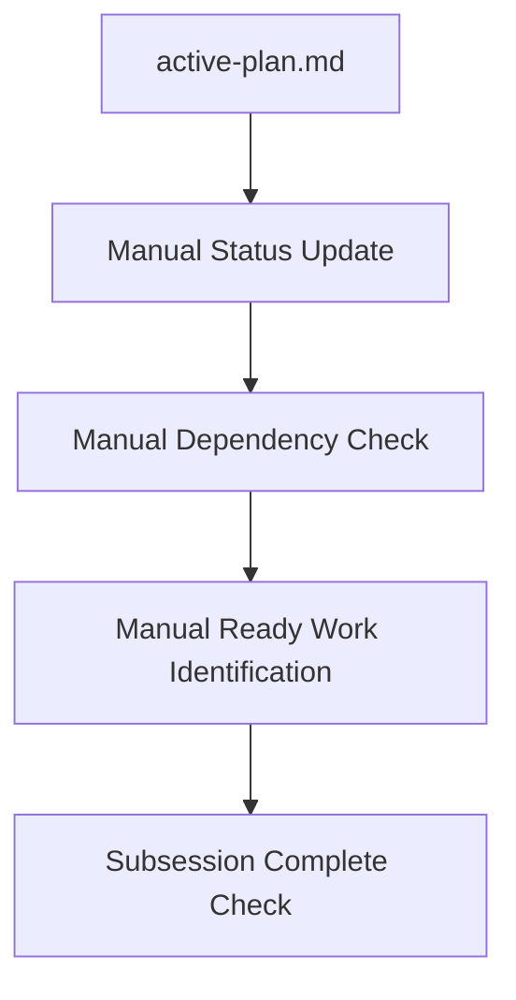
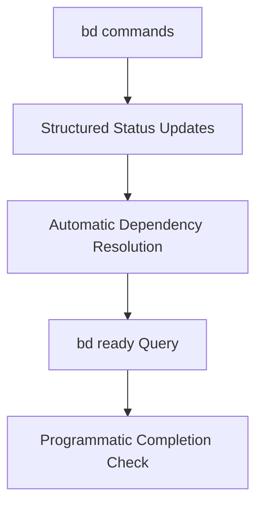

# RFC: Comparing Subsession Processes - Markdown Task Lists vs BD Integration

## Status

**Status:** Draft
**Date:** 2025-10-16
**Author:** Integration Session (2025-10-16-integrate-bd)
**Related Session:** [2025-10-16-integrate-bd](SESSION.md)

## Abstract

This RFC compares two approaches for managing subsession workflows in the agent session protocol:

1. **Current Approach:** Manual subsession tracking using markdown task lists in `active-plan.md` files
2. **Proposed Approach:** Integration of the `bd` issue tracker for dependency-aware task management

The analysis examines the strengths, limitations, and migration implications of each approach.

## Background

### Current Subsession Process (Markdown Task Lists)

The current session protocol uses manual task management through markdown files:

```markdown
# active-plan.md structure

## Current Subsession
- [ ] Task 1
- [ ] Task 2
  - [ ] Sub-task 2.1
  - [ ] Sub-task 2.2

## Issues & Blockers
- [ ] Issue 1: Waiting for external dependency

## Next Actions
1. Complete current subsession
2. Start next subsession
```

**Key Characteristics:**
- Manual status tracking via checkbox updates
- No dependency enforcement between tasks
- No cycle detection for task relationships
- Status queries require manual inspection
- No programmatic querying capabilities

### BD Integration Approach

The proposed BD integration introduces structured task management:

```bash
# BD command examples for subsession workflow
bd create "Setup infrastructure" --label subsession-1 --status pending
bd create "Implement core scripts" --label subsession-3 --status pending
bd dep add "Implement core scripts" "Setup infrastructure"  # Dependency relationship
bd status  # Query current status
bd ready   # Show unblocked work
```

**Key Characteristics:**
- Dependency-aware task tracking with blocking relationships
- Cycle detection for task dependencies
- Queryable status via JSON API (`bd export`)
- Git-friendly JSONL export for version control
- `bd ready` surfaces actionable work

## Detailed Comparison

### Task Creation and Management

| Aspect | Markdown Task Lists | BD Integration |
|--------|-------------------|----------------|
| **Creation** | Manual markdown editing | `bd create` command |
| **Dependencies** | Manual notation, no enforcement | `bd dep` commands, enforced |
| **Status** | Checkbox-based, manual | Structured status fields |
| **Labels** | Free-form text | Structured label system |
| **Cycle Detection** | Manual, error-prone | Automatic detection |

### Status Tracking and Queries

| Feature | Markdown Task Lists | BD Integration |
|---------|-------------------|----------------|
| **Status Updates** | Manual checkbox editing | `bd status` commands |
| **Progress Queries** | Visual scanning required | `bd status`, `bd ready` |
| **Blocked Work** | Manual identification | `bd dep` relationships |
| **Work Prioritization** | Manual ordering | `bd ready` algorithm |
| **API Access** | None | JSON export (`bd export`) |

### Dependency Management

**Current Limitations:**
- No automatic dependency validation
- Manual tracking of blocking relationships
- Risk of circular dependencies undetected
- Manual identification of ready work

**BD Advantages:**
- Explicit dependency declarations (`bd dep add`)
- Automatic cycle detection
- Queryable dependency chains
- `bd ready` surfaces actionable work

### Development Workflow Integration

| Workflow Step | Markdown Task Lists | BD Integration |
|---------------|-------------------|----------------|
| **TDD Cycles** | Manual task breakdown | Structured RED/GREEN/REFACTOR phases |
| **Subsession Planning** | Free-form task lists | Structured issue hierarchy |
| **Progress Reporting** | Manual status updates | Query-based reporting |
| **Learning Extraction** | Manual review of changes | Structured issue completion data |

## Implementation Analysis

### Current Subsession Workflow



**Key Operations:**
1. Edit `active-plan.md` to update task status
2. Manually scan for completed dependencies
3. Manually identify next actionable work
4. Manually check subsession completion criteria

### BD Integration Workflow



**Key Operations:**
1. Use `bd` commands for task management
2. Automatic dependency relationship tracking
3. Query-based identification of ready work
4. Programmatic completion validation

## Migration Strategy

### Backward Compatibility

**Approach:** Maintain markdown files as read-only views during transition

1. **Phase 1:** BD becomes primary task management system
2. **Phase 2:** Markdown files generated from BD state for compatibility
3. **Phase 3:** Gradual deprecation of manual markdown editing

### Script Updates Required

| Script | Current Behavior | BD Integration Changes |
|--------|------------------|----------------------|
| **session-claim** | Creates `active-plan.md` | Initialize BD database, create initial structure |
| **subsession-start** | Updates `active-plan.md` | Create BD issues with TDD structure |
| **work-ready** | Manual markdown parsing | Query `bd ready` for actionable work |
| **subsession-complete** | Manual status checking | Validate BD issue completion |
| **session-complete** | Manual review | Extract BD completion data for learnings |

### Learning Curve Considerations

**Agent Training Requirements:**
- BD command familiarity (`bd create`, `bd status`, `bd dep`)
- Understanding of dependency relationships
- Query-based workflow patterns
- JSONL export format for git integration

**Documentation Needs:**
- BD command reference in knowledge base
- Workflow examples for common patterns
- Troubleshooting guide for BD-specific issues
- Migration guide for existing sessions

## Performance Impact

### Operational Efficiency

| Metric | Markdown Task Lists | BD Integration |
|--------|-------------------|----------------|
| **Task Creation** | Manual editing overhead | Single command execution |
| **Dependency Tracking** | Manual relationship management | Automatic dependency resolution |
| **Status Queries** | Visual scanning required | Instant programmatic queries |
| **Ready Work Identification** | Manual analysis needed | `bd ready` algorithmic determination |
| **Cycle Detection** | Manual, error-prone | Automatic prevention |

### Cognitive Load

**Current Process:**
- Context switching between editing and analysis
- Manual dependency graph maintenance
- Risk of inconsistent task states
- Manual identification of completion criteria

**BD Process:**
- Declarative task relationship specification
- Automatic consistency enforcement
- Query-driven workflow decisions
- Structured completion validation

## Risk Assessment

### Migration Risks

| Risk | Impact | Mitigation |
|------|--------|------------|
| **BD Installation Issues** | High | Check in session-claim, clear error messages |
| **Learning Curve** | Medium | Comprehensive KB documentation |
| **Script Complexity** | Medium | Incremental integration, maintain compatibility |
| **Git Conflicts** | Low | JSONL export format, clear .gitignore rules |
| **Performance** | Low | Minimal overhead for task management operations |

### Rollback Strategy

**If BD integration proves problematic:**

1. **Immediate:** Fall back to markdown-only workflow
2. **Session-level:** Complete current session using markdown approach
3. **Protocol-level:** Document issues, consider alternative task management tools
4. **Long-term:** Evaluate if structured task management is worth the complexity

## Recommendations

### Primary Recommendation: Proceed with BD Integration

**Rationale:**
1. **Fundamental Improvement:** BD addresses core limitations of manual task tracking
2. **Dependency Management:** Automatic dependency resolution prevents common workflow errors
3. **Query Capabilities:** Programmatic access enables smarter workflow automation
4. **TDD Integration:** Structured support for RED/GREEN/REFACTOR cycles
5. **Git Integration:** JSONL export format designed for version control workflows

### Implementation Priority

1. **Phase 1:** Infrastructure setup (BD installation, .gitignore rules)
2. **Phase 2:** Knowledge base creation (BD documentation, command reference)
3. **Phase 3:** Core script updates (session-claim, subsession-start, work-ready)
4. **Phase 4:** Advanced script updates (completion validation, learning extraction)
5. **Phase 5:** Documentation and validation (protocol updates, test session)

### Success Metrics

- [ ] All utility scripts updated for BD integration
- [ ] BD knowledge base provides comprehensive guidance
- [ ] Test session completes successfully using BD workflow
- [ ] No regression in existing session protocol functionality
- [ ] Improved agent experience (faster queries, clearer dependencies)

## Alternatives Considered

### Option 1: Enhanced Markdown Approach
- **Description:** Add tooling around markdown parsing and dependency analysis
- **Pros:** Minimal infrastructure changes, leverages existing patterns
- **Cons:** Still manual dependency management, no automatic cycle detection
- **Rejected:** Doesn't solve fundamental limitations of manual approach

### Option 2: GitHub Issues Integration
- **Description:** Use GitHub Issues for task tracking with API integration
- **Pros:** Rich web interface, external visibility, API access
- **Cons:** External dependency, not git-native, potential rate limits
- **Rejected:** Adds external complexity, not designed for local-first workflow

### Option 3: Custom Task Management System
- **Description:** Build custom task tracker optimized for session protocol
- **Pros:** Perfect fit for workflow needs, full control
- **Cons:** Significant development overhead, maintenance burden
- **Rejected:** BD provides 90% of needed functionality with proven implementation

## Open Questions

1. **BD Version Pinning:** Should we specify minimum BD version requirements?
2. **Error Handling:** How should scripts handle BD command failures?
3. **Performance:** What are the performance implications for large session workflows?
4. **Backup Strategy:** How to handle BD database corruption scenarios?

## Conclusion

The BD integration represents a significant improvement over manual markdown task list management. While it introduces some complexity in tooling and learning curve, the benefits in dependency management, query capabilities, and workflow automation justify the transition.

**Recommendation:** Proceed with BD integration as outlined in the session plan, with careful attention to backward compatibility and comprehensive documentation.

---
*This RFC is part of session [2025-10-16-integrate-bd](SESSION.md) and should be referenced when implementing BD integration components.*